<!-- SPDX-FileCopyrightText: 2026 OPPO -->
<!-- SPDX-License-Identifier: Apache-2.0 -->

# Performance Trace Mermaid Map

This document uses Mermaid diagrams to describe the current performance
trace design: which trace points are produced by user actions, main-thread
IPC, the API / Prompt Bridge, the PTY subprocess, Task state transitions,
and the renderer paint pipeline — and how the automated checks prove
these points are actually visible.

The trace file uses the Chrome Trace / Perfetto compatible JSON format.
Enable it with:

```bash
ONWARD_PERF_TRACE=1
```

Raw input content is NOT recorded by default — only length, line count,
and a hash. Opt in only when manually debugging payload content:

```bash
ONWARD_PERF_TRACE_CAPTURE_CONTENT=1
```

Two additional runtime knobs:

| Environment variable | Purpose |
| --- | --- |
| `ONWARD_PERF_TRACE_FLUSH_SEC` | Periodic flush-to-disk interval, default `30` seconds; `0` means flush only on quit or manual flush |
| `ONWARD_PERF_TRACE_MAX_MB` | In-memory trace buffer cap, default `256` MB; once exceeded, `droppedEvents` increments |

## Event types

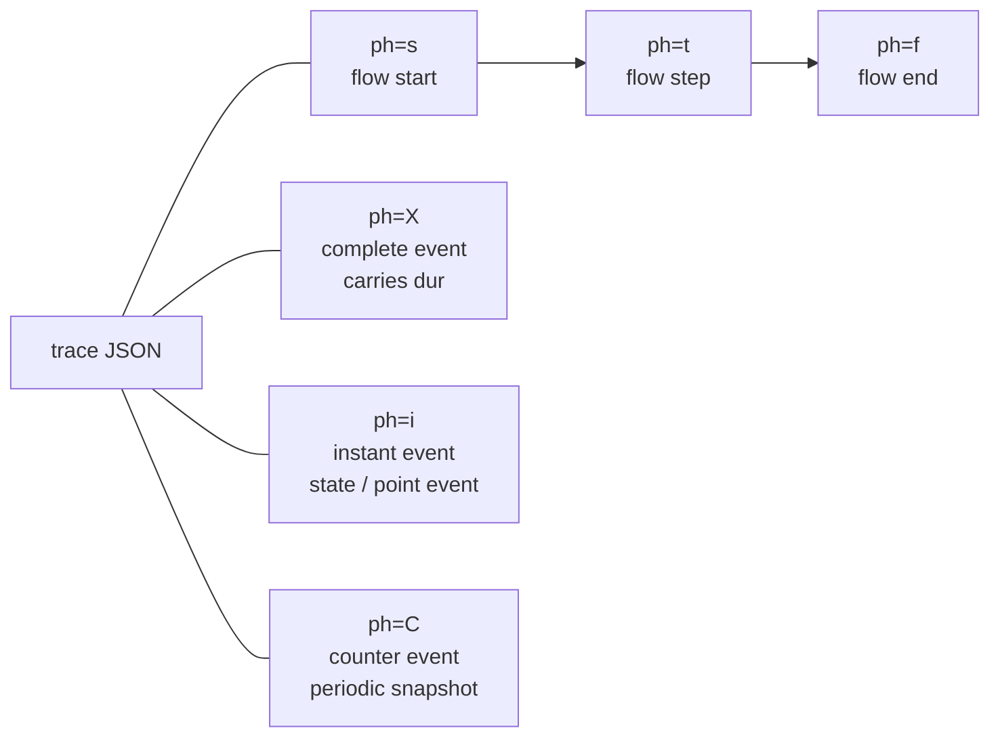

When reading a trace, look at three categories first:

| Type | Use | Example |
| --- | --- | --- |
| `ph=X` | Inspect duration | `ui.prompt.action`, `ipc.invoke`, `pty.write`, `terminal.render.flush` |
| `ph=i` | Inspect state and point-in-time events | `ui.prompt.edit`, `ui.prompt.task_select`, `pty.output`, `terminal.task.state` |
| `ph=s/t/f` | Trace how one user action flows across processes | `ui.prompt.action -> ipc.terminal.write -> terminal.render.flush` |
| `ph=C` | Inspect 1-second-granularity performance counters | `perf.renderer.snapshot` |

## Diff review of newly-added trace coverage

Another Coding Agent introduced several new trace capabilities in the
working tree; reviewed against the current directory state:

| Change | Verdict | Action taken |
| --- | --- | --- |
| `git.runtime.task` | Useful — exposes the Git scheduler queue, concurrency, and duration. Explains whether Git polling / cwd probing is piling up. | Privacy issue fixed: no longer writes raw `repoKey` / `label`; uses length + hash instead. |
| `markdown.render.worker` | Useful — surfaces real Markdown worker render duration; good for diagnosing Project Editor / preview lag. | Kept; documentation extended on the Project Editor path. |
| `project_editor.render.apply` | Right direction, but the original implementation only measured the apply *scheduling* time, not the actual DOMPurify / apply time. | Moved into the idle apply callback so it records DOMPurify / setState invocation time. |
| `pty.dispose` / `pty.shutdown_all` | Useful — confirms that PTY teardown is hermetic on quit, agent restart, or app close. | Documentation extended on the PTY lifecycle. |
| `ONWARD_PERF_TRACE_FLUSH_SEC` / `ONWARD_PERF_TRACE_MAX_MB` | Useful — adds disk-flush guarantees for crash scenarios and an in-memory cap. | Documentation extended on env vars and the `trace.session.start` payload. |
| `scripts/trace-coverage-audit.mjs` | Useful — provides a registry / code / trace three-way self-consistency check. | Documentation extended on the verification path. |
| `scripts/trace-narrate.mjs` | Useful — converts a trace into a human-readable, time-ordered narrative. | Documentation extended on the reading path. |

## End-to-end map


## User sends a command from the Prompt panel

User actions covered: editing the Prompt, selecting a Task, clicking
`Send`, then `Execute`, or clicking `Send and Execute`.

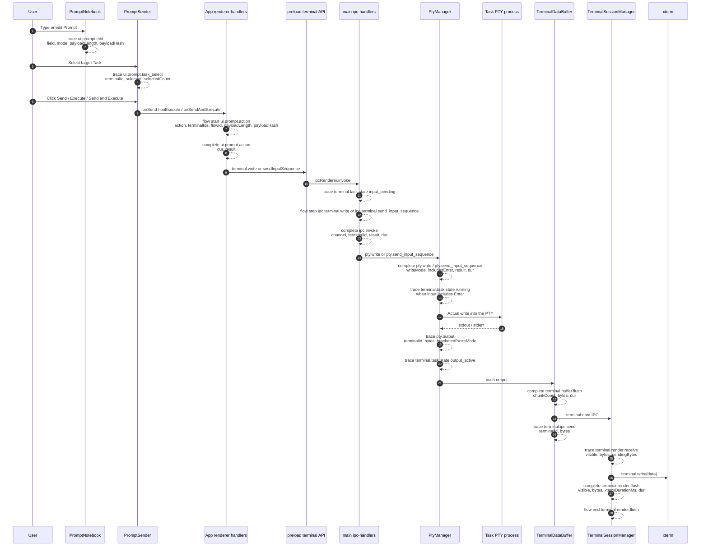

The key self-proof on this path is that the same `flowId` simultaneously
appears in:

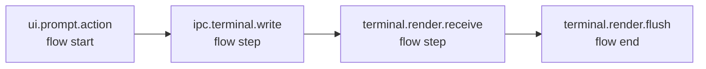

If the validation script cannot find a single `flowId` spanning UI, IPC,
and renderer, the trace has not proved the closed loop from "user action"
to "user-visible output."

## HTTP API sending to a Task

Program behaviour covered: external clients or test code call
`/api/terminal/:id/write`; the Onward main process forwards the request
through the Prompt Bridge so the renderer can reuse the same Prompt-send
logic.

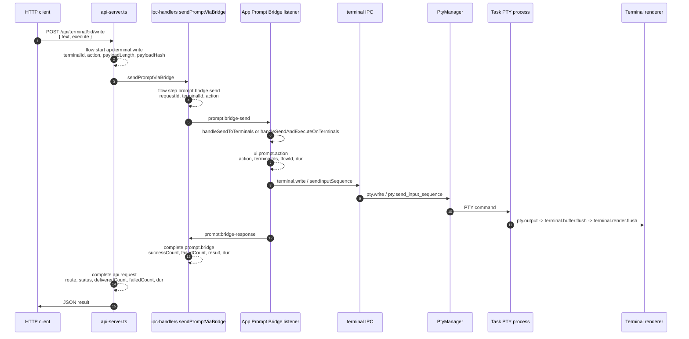

What to look for during validation:

| Behaviour | Trace points that must appear |
| --- | --- |
| API received the request | `api.terminal.write`, `api.request` |
| Main process forwarded to renderer | `prompt.bridge.send`, `prompt.bridge` |
| Renderer reused Prompt-send logic | `ui.prompt.action` |
| Eventually reached the PTY and rendered | `pty.write`, `pty.output`, `terminal.render.flush` |

## Task state machine

`terminal.task.state` is the core event answering "is this Task currently
working?" It does not depend on a particular command string — it derives
state from input, execution, output, and exit signals.

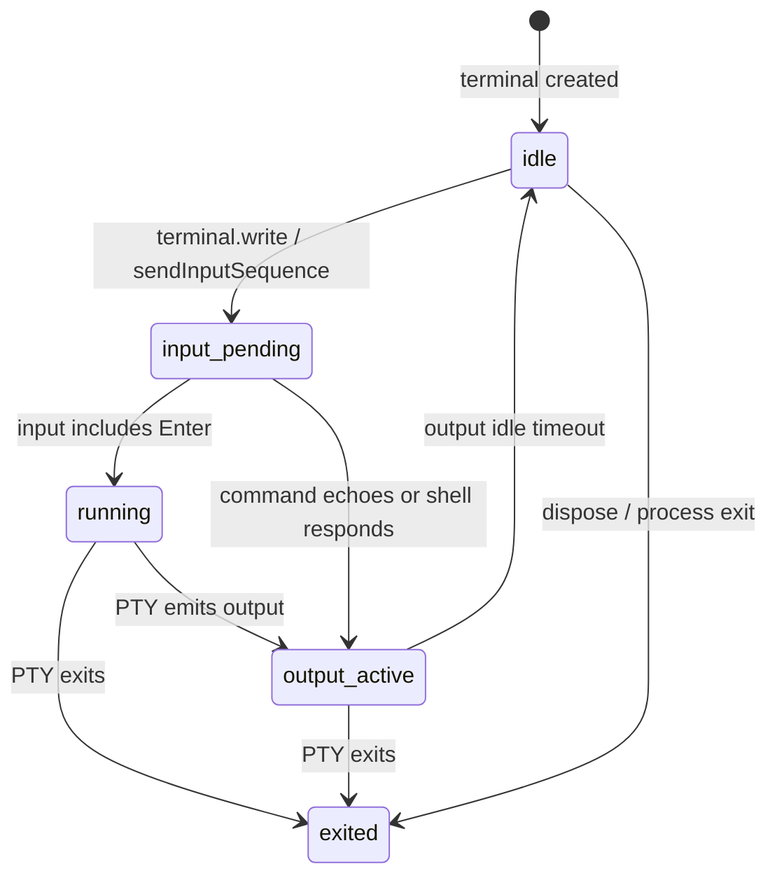

Per-state fields:

| state | When emitted | Key fields |
| --- | --- | --- |
| `input_pending` | renderer or API wrote input to a Task | `terminalId`, `flowId`, `inputKind`, `payloadLength`, `payloadHash` |
| `running` | input contained Enter, meaning the command was executed | `terminalId`, `flowId`, `reason` |
| `output_active` | PTY produced output | `terminalId`, `flowId`, `bytes` |
| `idle` | output stopped for a short window | `terminalId`, `flowId`, `reason` |
| `exited` | PTY process exited | `terminalId`, `flowId`, `exitCode`, `signal` |

## Coding Agent / subprocess startup

Program behaviour covered: configuring and launching a coding agent.
Onward rebuilds the target Task's PTY so it can execute the agent
command.

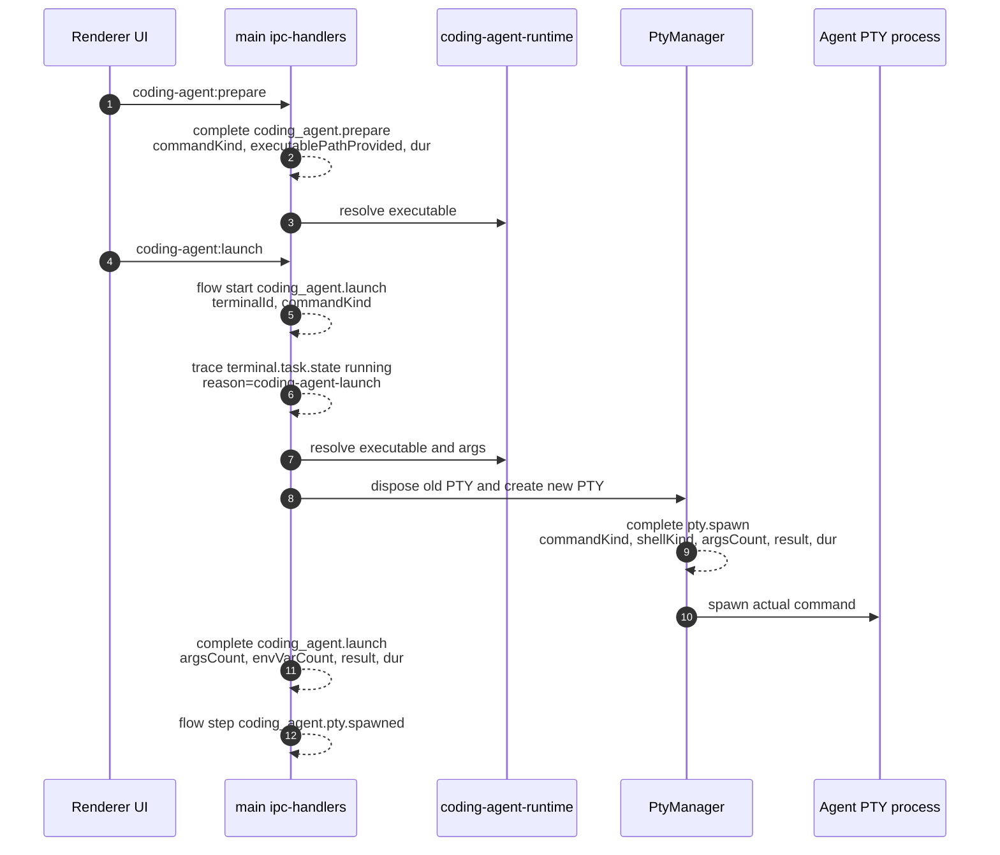

This proves two things:

1. `coding_agent.launch` confirms Onward actually initiated the agent launch.
2. `pty.spawn` confirms the Task was backed by a real OS process via PTY.

If launch fails, a `coding_agent.launch.error` flow end is emitted; if
the launch restarts an existing Task, you'll see the old PTY's
`pty.dispose` paired with the new PTY's `pty.spawn`.

## Output backflow and render duration

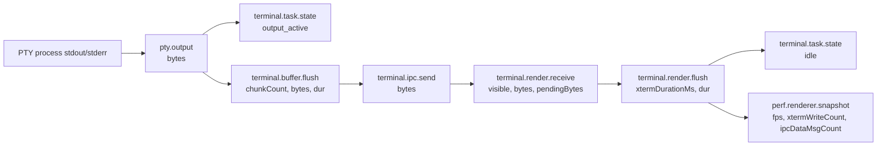

When the UI feels laggy, look at these events first:

| Symptom | Inspect |
| --- | --- |
| Main process emitting output too frequently | `pty.output`, `terminal.buffer.flush`, `terminal.ipc.send` |
| Renderer slow to write into xterm | `terminal.render.flush.dur`, `xtermDurationMs` |
| Hidden terminal still consuming resources | `terminal.render.receive.visible`, `terminal.render.hidden_buffer` |
| Overall load at 1-second granularity | `perf.renderer.snapshot` |

## Git and Project Editor

Two non-terminal performance paths added by the other Agent — primarily
to explain "the terminal isn't slow but the UI still feels slow."

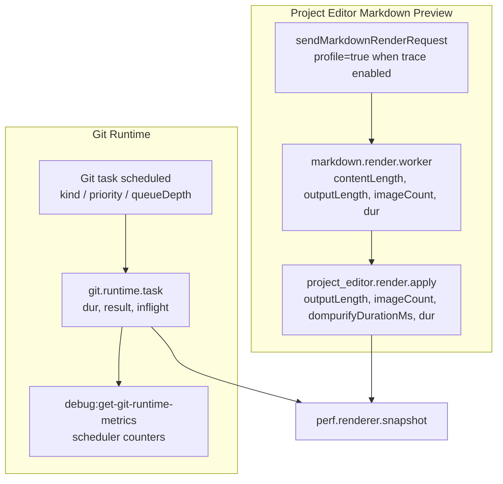

Limits of these two paths:

| Trace point | Proves | Does NOT prove |
| --- | --- | --- |
| `git.runtime.task` | A Git scheduler task's queue depth, concurrency, success / failure, and duration | Does not display the raw repo path or full Git arguments by default |
| `markdown.render.worker` | Worker-side Markdown render duration | Does not include DOM apply or browser paint time |
| `project_editor.render.apply` | Renderer-side DOMPurify and React setState invocation duration | Not equivalent to the browser's final paint completion time |

## PTY lifecycle

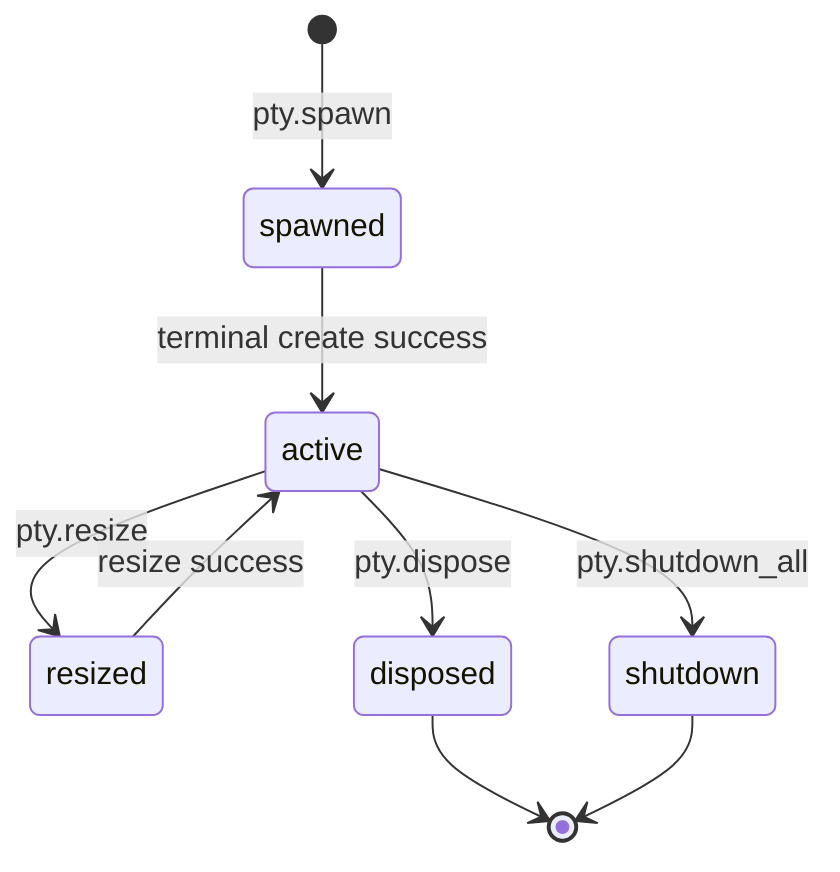

Lifecycle events used to verify cleanup is hermetic:

| Scenario | Must see |
| --- | --- |
| Create a Task | `pty.spawn.result=success` |
| Resize the terminal | `pty.resize.result=success` |
| Close a single Task or restart an agent | `pty.dispose.result=success` |
| App quit | `pty.shutdown_all.total`, `closed`, `timedOut` |

## Trace Point Registry

| Trace point | Type | Location | Description | Key fields |
| --- | --- | --- | --- | --- |
| `trace.session.start` | instant | main | Trace session started | `schema`, `platform`, `appVersion`, `contentCaptured`, `flushIntervalSec`, `maxBufferMB` |
| `trace.session.flush` | complete | main | Trace JSON written | `reason`, `eventCount`, `droppedEvents`, `dur` |
| `ui.prompt.edit` | instant | renderer | Prompt content or title changed | `field`, `mode`, `payloadLength`, `payloadLineCount`, `payloadHash` |
| `ui.prompt.task_select` | instant | renderer | Task selection toggled | `terminalId`, `selected`, `selectedCount`, `totalCount` |
| `ui.prompt.action` | complete + flow start | renderer | Send / Execute / Send and Execute | `action`, `terminalIds`, `flowId`, `result`, `dur` |
| `ui.prompt.action.done` | flow end | renderer | Prompt action completed | `successCount`, `sentOnlyCount`, `failedCount` |
| `ui.terminal.write` | flow step | renderer | Renderer decided to write to terminal | `terminalId`, `action`, `payloadLength`, `payloadHash` |
| `ui.terminal.paste` | flow step | renderer | Send via paste mode | `terminalId`, `shellKind`, `payloadLength`, `payloadHash` |
| `ui.terminal.send_input_sequence` | flow step | renderer | Send input in stages | `terminalId`, `kind`, `ok`, `phase` |
| `api.terminal.write` | flow start/result | main | API write-to-Task flow | `terminalId`, `action`, `payloadLength`, `payloadHash`, `status` |
| `api.terminal.write.result` | flow step | main | API write-to-Task result | `terminalId`, `action`, `status`, `deliveredCount`, `failedCount` |
| `api.request` | complete | main | HTTP API request | `route`, `terminalId`, `action`, `status`, `deliveredCount`, `failedCount`, `dur` |
| `prompt.bridge.send` | flow step | main | Main process asks renderer to perform a Prompt action | `requestId`, `terminalId`, `action` |
| `prompt.bridge.response` | flow step | main | Renderer returns Prompt Bridge result | `requestId`, `terminalId`, `action`, `successCount`, `failedCount` |
| `prompt.bridge.timeout` | flow end | main | Prompt Bridge timed out | `requestId`, `terminalId`, `action` |
| `prompt.bridge` | complete | main | Prompt Bridge round-trip | `requestId`, `terminalId`, `action`, `successCount`, `failedCount`, `result`, `dur` |
| `ipc.invoke` | complete | main | IPC handler duration | `channel`, `terminalId`, `result`, `dur` |
| `ipc.terminal.write` | flow step | main | IPC write to terminal | `terminalId`, `includesEnter`, `payloadLength`, `payloadHash` |
| `ipc.terminal.send_input_sequence` | flow step | main | IPC staged input | `terminalId`, `kind`, `payloadLength`, `payloadHash` |
| `pty.spawn` | complete | main / PTY | Real PTY process created | `terminalId`, `commandKind`, `shellKind`, `argsCount`, `cwdProvided`, `result`, `dur` |
| `pty.write` | complete | main / PTY | Write into PTY | `terminalId`, `writeMode`, `includesEnter`, `payloadLength`, `payloadHash`, `result`, `dur` |
| `pty.send_input_sequence` | complete | main / PTY | Large-text / paste sequence written into PTY | `terminalId`, `phase`, `enterDelayMs`, `result`, `dur` |
| `pty.resize` | complete | main / PTY | PTY resized | `terminalId`, `cols`, `rows`, `result`, `dur` |
| `pty.dispose` | complete | main / PTY | Single PTY closed | `terminalId`, `result`, `dur` |
| `pty.shutdown_all` | complete | main / PTY | All PTYs closed on app quit | `total`, `closed`, `timedOut`, `dur` |
| `pty.output` | instant | main / PTY | PTY output | `terminalId`, `bytes`, `bracketedPasteMode`, `flowId` |
| `terminal.task.state` | instant | main / task thread | Task activity state | `terminalId`, `state`, `flowId`, `reason`, `bytes` |
| `terminal.buffer.flush` | complete | main | Coalesce PTY output and forward to renderer | `terminalId`, `chunkCount`, `bytes`, `dur` |
| `terminal.ipc.send` | instant | main | Send `terminal:data` to renderer | `terminalId`, `bytes`, `flowId` |
| `terminal.render.receive` | instant + flow step | renderer | Renderer received terminal output | `terminalId`, `visible`, `bytes`, `pendingBytes`, `flowId` |
| `terminal.render.flush` | complete + flow end | renderer | Written into xterm | `terminalId`, `visible`, `bytes`, `xtermDurationMs`, `dur`, `flowId` |
| `terminal.render.hidden_buffer` | counter | renderer | Hidden terminal buffer | `terminalId`, `pendingChunks`, `pendingBytes` |
| `terminal.input` | instant | renderer | User typed directly into the terminal | `terminalId`, `payloadLength`, `payloadHash`, `includesEnter` |
| `perf.renderer.snapshot` | counter | renderer | 1-second perf snapshot | `fps`, `frameDrops`, `xtermWriteCount`, `ipcDataMsgCount`, `inputLatencyAvgMs` |
| `coding_agent.prepare` | complete | main | Check agent runtime | `commandKind`, `executablePathProvided`, `result`, `dur` |
| `coding_agent.launch` | complete + flow start | main | Launch coding agent | `terminalId`, `commandKind`, `argsCount`, `envVarCount`, `result`, `dur` |
| `coding_agent.launch.error` | flow end | main | Agent launch failed | `terminalId`, `reason` |
| `coding_agent.pty.spawned` | flow step | main | Agent PTY created | `terminalId` |
| `git.runtime.task` | complete | main | Git scheduler task | `kind`, `priority`, `repoScoped`, `repoKeyLength`, `repoKeyHash`, `labelLength`, `labelHash`, `queueDepth`, `inflight`, `result`, `dur` |
| `markdown.render.worker` | complete | renderer worker result | Markdown worker render | `contentLength`, `outputLength`, `imageCount`, `profileFlag`, `dur` |
| `project_editor.render.apply` | complete | renderer | Markdown preview DOMPurify / setState apply | `outputLength`, `imageCount`, `dompurifyDurationMs`, `dur` |

## Automated verification mapping

`test/autotest/validate-performance-trace-contract.mjs` reads the trace JSON and
checks the following contracts. It does NOT verify "logs exist" — it
verifies "the trace can reconstruct critical behaviour."

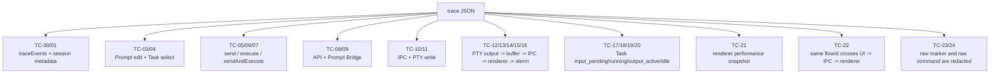

The other Agent's three-way audit and narration tools complete the
"is the verification exhaustive" and "can a human read it" proofs:

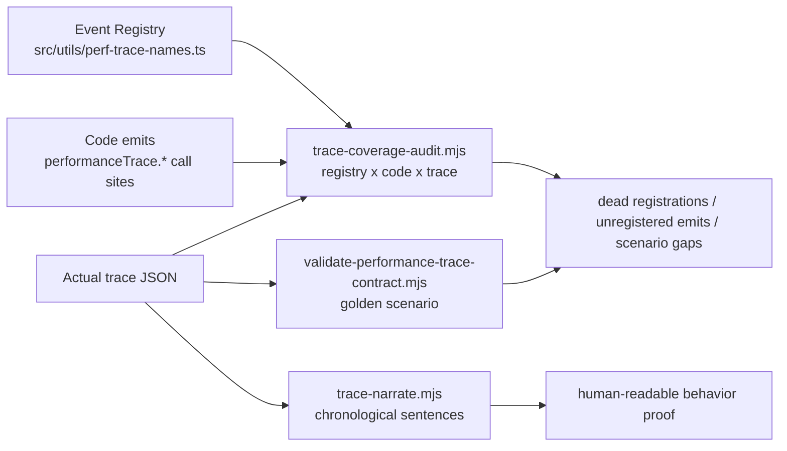

| Contract | What it proves |
| --- | --- |
| TC-03/04 | User input and target Task selection are observable |
| TC-05/06/07 | All three Prompt actions carry duration and result |
| TC-08/09 | The external API → renderer Prompt Bridge path is visible |
| TC-10/11 | Main-thread IPC and PTY writes are visible |
| TC-12 .. TC-16 | The subprocess-output-back-to-screen path is visible |
| TC-17 .. TC-20 | Whether a Task is working, when it outputs, when it idles, are visible |
| TC-22 | The cross-process flow of the same user action stays linked |
| TC-23/24 | The default configuration does not leak raw input content |
| Coverage audit | Registry, code emit sites, and actual trace agree — no unregistered events or dead registrations |
| Trace narration | The chronological story of what Onward was doing can be read out |

## Common-behaviour to trace-point cheat sheet

| Behaviour you want to verify | Trace points to look for |
| --- | --- |
| Size of user input | `ui.prompt.edit.payloadLength`, `payloadLineCount`, `payloadHash` |
| Which Task the user selected | `ui.prompt.task_select.terminalId`, `selectedCount` |
| Whether Send fired and how long it took | `ui.prompt.action[action=send].dur` |
| Whether Execute actually triggered the command | `ipc.terminal.write.includesEnter=true`, `terminal.task.state[state=running]` |
| Whether the command was actually written into the PTY | `pty.write.result=success` or `pty.send_input_sequence.result=success` |
| Whether the Task is working in the background | `terminal.task.state` transitions from `input_pending/running` to `output_active` |
| Whether Task output reached the main process | `pty.output.bytes` |
| Whether the main process forwarded output to the renderer | `terminal.buffer.flush`, `terminal.ipc.send` |
| Whether the UI actually rendered the output | `terminal.render.receive`, `terminal.render.flush` |
| Whether rendering is slow | `terminal.render.flush.dur`, `xtermDurationMs`, `perf.renderer.snapshot` |
| Whether API writes succeeded end-to-end | `api.request.status`, `prompt.bridge.result`, `ui.prompt.action` |
| Whether the Coding Agent launched via PTY | `coding_agent.launch`, `pty.spawn`, `terminal.task.state[state=running]` |
| Whether Git polling / cwd probing is piling up | `git.runtime.task.queueDepth`, `inflight`, `dur` |
| Whether Markdown preview is slow | `markdown.render.worker.dur`, `project_editor.render.apply.dur` |
| Whether PTY teardown is hermetic | `pty.dispose`, `pty.shutdown_all.closed`, `timedOut` |
| Whether trace registry agrees with code | `node scripts/trace-coverage-audit.mjs --latest` |
| Whether the trace is human-readable | `node scripts/trace-narrate.mjs --latest` |

## Minimal verification commands

Common verification commands for the macOS development build:

```bash
rm -rf out release && ONWARD_DIST_DEV_OPEN=0 pnpm dist:dev
bash test/autotest/run-performance-trace-autotest.sh "release/mac/Under Development 2.0.1-event_trace_gate_0424_codex.app/Contents/MacOS/Under Development 2.0.1-event_trace_gate_0424_codex"
```

The script prints the trace file path and invokes:

```bash
node test/autotest/validate-performance-trace-contract.mjs "<trace-file>"
node scripts/trace-coverage-audit.mjs "<trace-file>"
node scripts/trace-narrate.mjs "<trace-file>" | head -80
```

Pass criterion:

```text
Performance trace contract PASSED: 25 checks
```
