<!-- SPDX-FileCopyrightText: 2026 OPPO -->
<!-- SPDX-License-Identifier: Apache-2.0 -->

# Performance Trace Mermaid Map

本文用 Mermaid 图说明当前 performance trace 的设计：用户操作、主线程 IPC、API/Prompt Bridge、PTY 子进程、Task 状态、renderer 渲染回流分别会产生哪些 trace point，以及自动化验证如何证明这些点确实可见。

trace 文件采用 Chrome Trace / Perfetto 兼容 JSON，启用方式：

```bash
ONWARD_PERF_TRACE=1
```

默认不记录原始输入内容，只记录长度、行数和 hash。需要人工调试内容时才开启：

```bash
ONWARD_PERF_TRACE_CAPTURE_CONTENT=1
```

另外两个运行时控制：

| 环境变量 | 作用 |
| --- | --- |
| `ONWARD_PERF_TRACE_FLUSH_SEC` | 周期性写盘间隔，默认 `30` 秒，`0` 表示只在退出或手动 flush 时写盘 |
| `ONWARD_PERF_TRACE_MAX_MB` | 内存中 trace buffer 上限，默认 `256` MB，超限后增加 `droppedEvents` |

## 事件类型

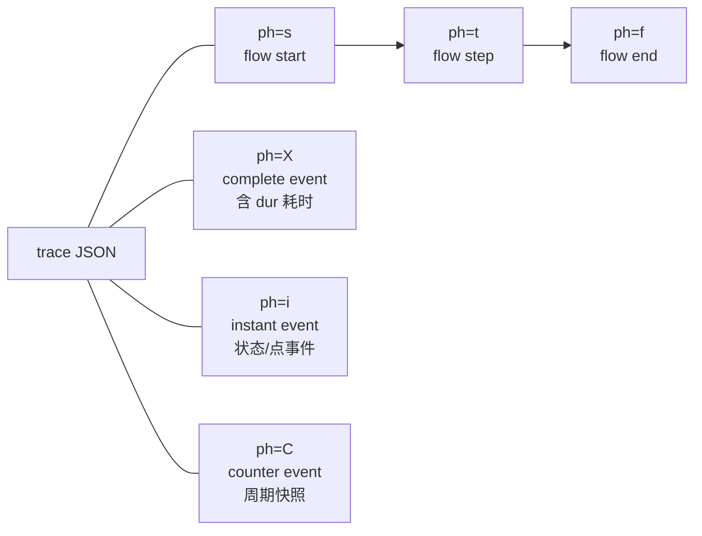

阅读 trace 时先看三类信息：

| 类型 | 用途 | 示例 |
| --- | --- | --- |
| `ph=X` | 看耗时 | `ui.prompt.action`, `ipc.invoke`, `pty.write`, `terminal.render.flush` |
| `ph=i` | 看状态和发生点 | `ui.prompt.edit`, `ui.prompt.task_select`, `pty.output`, `terminal.task.state` |
| `ph=s/t/f` | 看一条用户操作如何跨进程流动 | `ui.prompt.action -> ipc.terminal.write -> terminal.render.flush` |
| `ph=C` | 看 1 秒级性能计数 | `perf.renderer.snapshot` |

## 新增 Diff 评价

另一个 Coding Agent 在当前工作区新增了几类 trace 能力，我已按当前目录重新审阅：

| 新增改动 | 评价 | 已处理事项 |
| --- | --- | --- |
| `git.runtime.task` | 有价值，补上了 Git 调度器队列、并发和耗时视角，能解释 Git polling / cwd probe 是否堆积 | 已修正隐私风险：不再写原始 `repoKey` / `label`，改为长度和 hash |
| `markdown.render.worker` | 有价值，能看到 Markdown worker 真实渲染耗时，适合排查 Project Editor / preview 卡顿 | 保留，文档补充到 Project Editor 链路 |
| `project_editor.render.apply` | 方向正确，但原实现只量到 apply 调度时间，不是实际 DOMPurify/apply 时间 | 已移动到 idle apply 回调内部，记录 DOMPurify/setState 调用耗时 |
| `pty.dispose` / `pty.shutdown_all` | 有价值，能确认退出、重启 agent、关闭应用时 PTY 是否被收口 | 文档补充到 PTY 生命周期 |
| `ONWARD_PERF_TRACE_FLUSH_SEC` / `ONWARD_PERF_TRACE_MAX_MB` | 有价值，补上 crash 场景写盘和内存上限控制 | 文档补充环境变量和 trace session 字段 |
| `scripts/trace-coverage-audit.mjs` | 有价值，补上 registry / code / trace 的三方一致性自证 | 文档补充验证链路 |
| `scripts/trace-narrate.mjs` | 有价值，能把 trace 转成按时间排序的人类可读叙述 | 文档补充阅读链路 |

## 总体链路

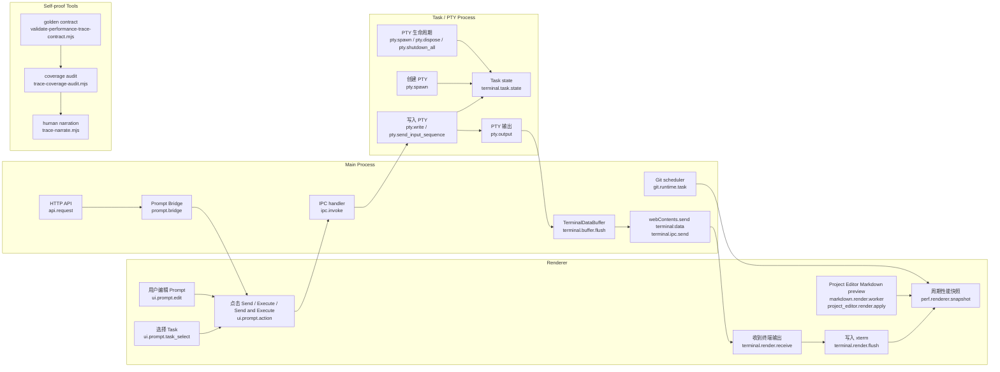

## 用户在 Prompt 面板发送命令

对应用户行为：编辑 Prompt，选择 Task，点击 `Send`，再点击 `Execute`，或点击 `Send and Execute`。

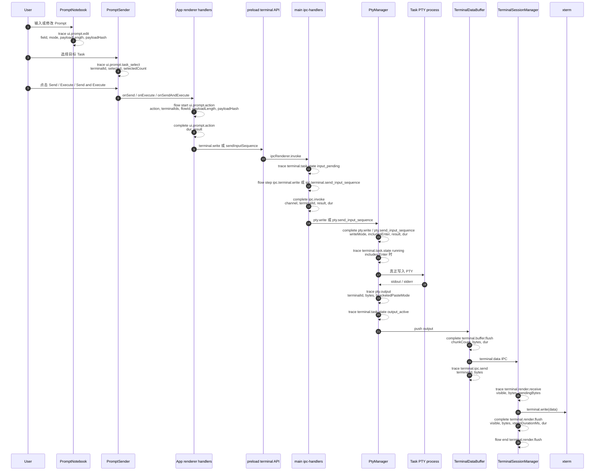

这条链路的关键自证点是同一个 `flowId` 会同时出现在：

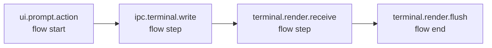

如果验证脚本找不到同一个 `flowId` 横跨 UI、IPC 和 renderer，则说明 trace 没有证明“用户操作到界面可见输出”的闭环。

## HTTP API 发送到 Task

对应程序行为：外部或测试代码调用 `/api/terminal/:id/write`，Onward 主进程把请求转成 Prompt Bridge，让 renderer 复用同一套 Prompt 发送逻辑。

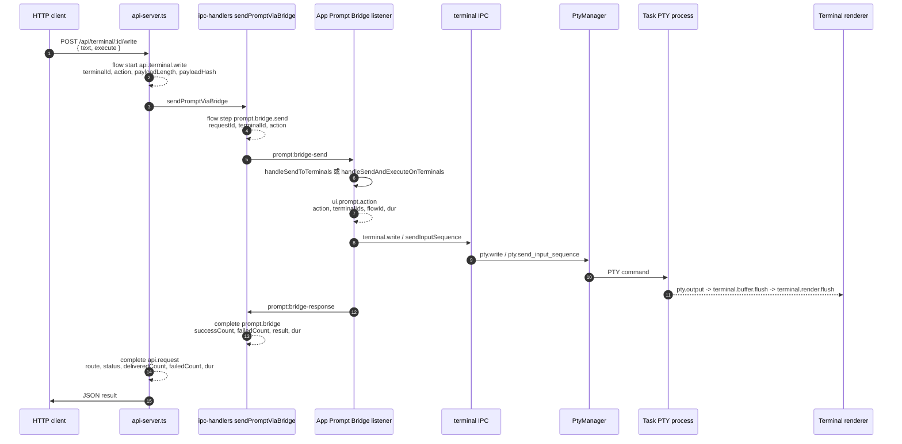

验证时要看：

| 行为 | 必须出现的 trace point |
| --- | --- |
| API 收到请求 | `api.terminal.write`, `api.request` |
| 主进程转发给 renderer | `prompt.bridge.send`, `prompt.bridge` |
| renderer 复用 Prompt 发送逻辑 | `ui.prompt.action` |
| 最终进入 PTY 并渲染 | `pty.write`, `pty.output`, `terminal.render.flush` |

## Task 状态机

`terminal.task.state` 是用来回答“这个 Task 现在是否在工作”的核心事件。它不是单独依赖某一个命令字符串，而是从输入、执行、输出和退出推导状态。

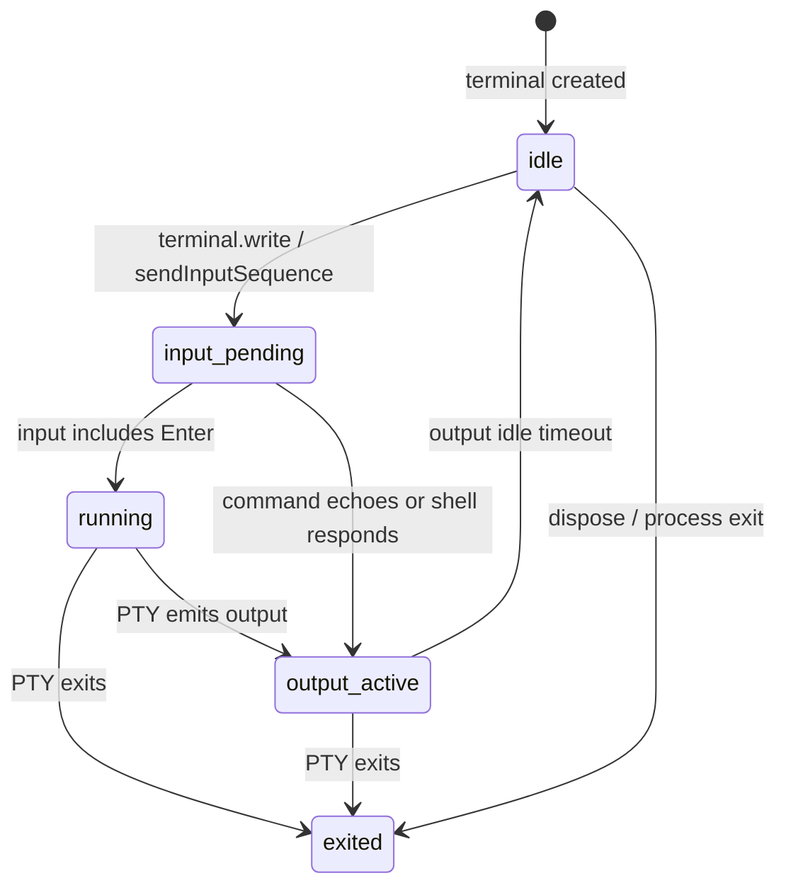

状态对应字段：

| state | 何时产生 | 关键字段 |
| --- | --- | --- |
| `input_pending` | renderer 或 API 把输入写给某个 Task | `terminalId`, `flowId`, `inputKind`, `payloadLength`, `payloadHash` |
| `running` | 输入里包含 Enter，代表命令被执行 | `terminalId`, `flowId`, `reason` |
| `output_active` | PTY 产生输出 | `terminalId`, `flowId`, `bytes` |
| `idle` | 输出停止一小段时间 | `terminalId`, `flowId`, `reason` |
| `exited` | PTY 进程退出 | `terminalId`, `flowId`, `exitCode`, `signal` |

## Coding Agent / 子进程启动

对应程序行为：配置并启动 coding agent，Onward 会重建目标 Task 的 PTY，让它执行 agent 命令。

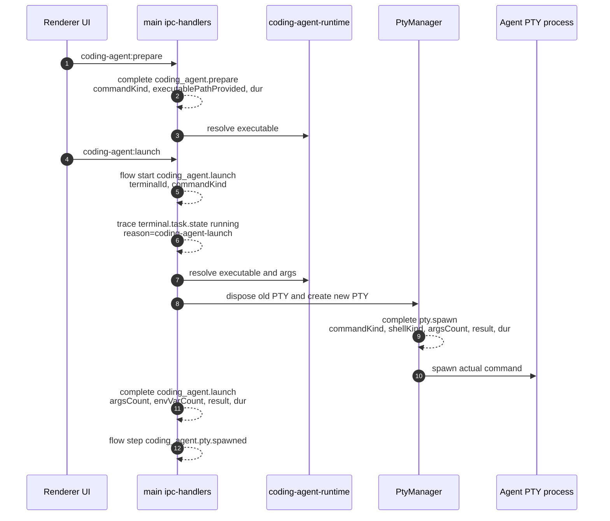

这里能证明两件事：

1. `coding_agent.launch` 表示 Onward 确实发起了 agent 启动。
2. `pty.spawn` 表示 Task 背后确实通过 PTY 创建了真实进程。

如果启动失败，会出现 `coding_agent.launch.error` flow end；如果重启已有 Task，会同时看到旧 PTY 的 `pty.dispose` 和新 PTY 的 `pty.spawn`。

## 输出回流与渲染耗时

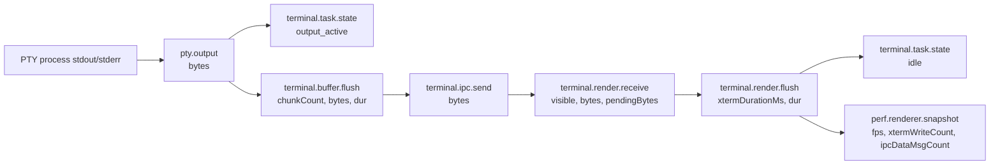

如果界面卡顿，优先看这些事件：

| 问题 | 优先看 |
| --- | --- |
| 主进程输出太频繁 | `pty.output`, `terminal.buffer.flush`, `terminal.ipc.send` |
| renderer 写入 xterm 慢 | `terminal.render.flush.dur`, `xtermDurationMs` |
| 隐藏终端仍在消耗资源 | `terminal.render.receive.visible`, `terminal.render.hidden_buffer` |
| 1 秒粒度整体负载 | `perf.renderer.snapshot` |

## Git 与 Project Editor

另一个 Agent 新增的两条非终端性能链路，主要用于解释“终端没卡但界面仍卡”的场景。

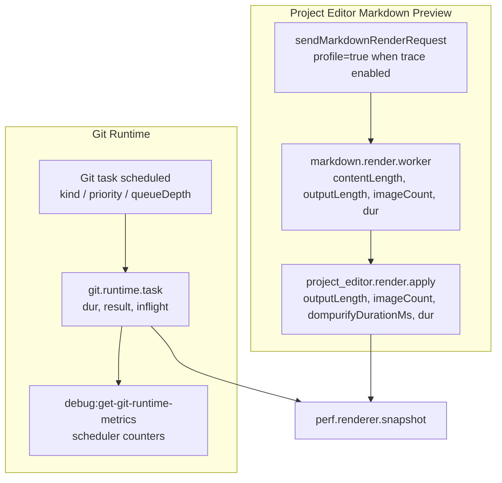

这两条链路的限制：

| Trace point | 能证明什么 | 不能证明什么 |
| --- | --- | --- |
| `git.runtime.task` | Git scheduler 中某个任务的排队深度、并发量、成功/失败和耗时 | 默认不显示原始 repo 路径或完整 Git 参数 |
| `markdown.render.worker` | worker 侧 Markdown 渲染耗时 | 不直接包含 DOM apply 和浏览器 paint 时间 |
| `project_editor.render.apply` | renderer 侧 DOMPurify 和 React setState 调用耗时 | 不等同于浏览器最终 paint 完成时间 |

## PTY 生命周期

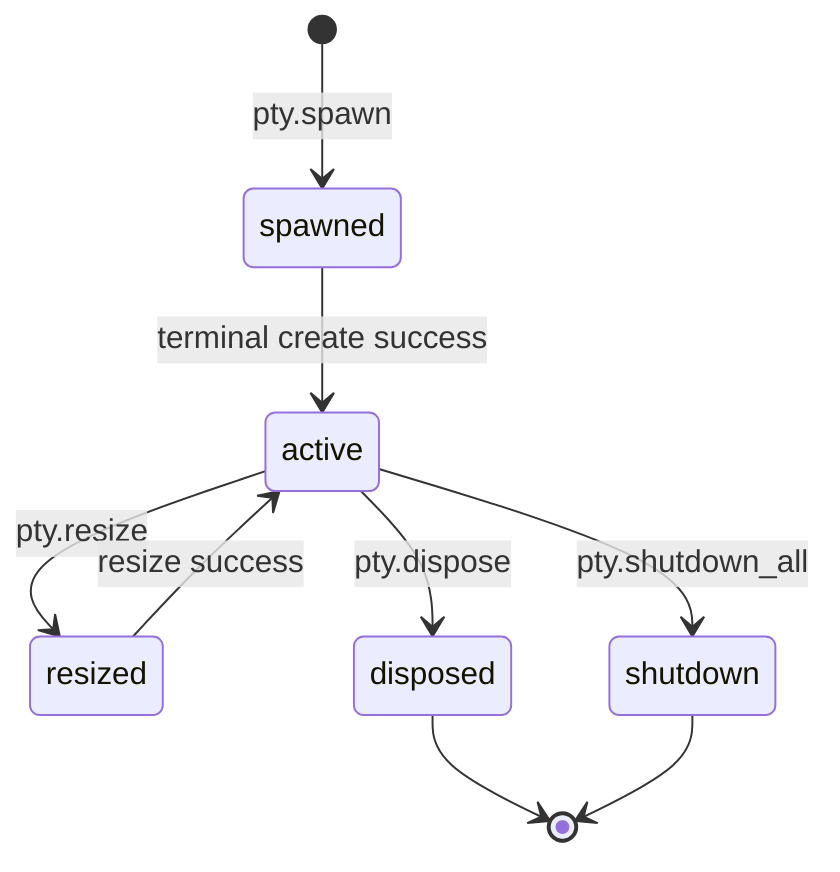

生命周期事件用于验证清理是否完整：

| 场景 | 需要看到 |
| --- | --- |
| 创建 Task | `pty.spawn.result=success` |
| 调整终端尺寸 | `pty.resize.result=success` |
| 关闭单个 Task 或重启 agent | `pty.dispose.result=success` |
| 应用退出 | `pty.shutdown_all.total`, `closed`, `timedOut` |

## Trace Point Registry

| Trace point | 类型 | 位置 | 说明 | 关键字段 |
| --- | --- | --- | --- | --- |
| `trace.session.start` | instant | main | trace 会话启动 | `schema`, `platform`, `appVersion`, `contentCaptured`, `flushIntervalSec`, `maxBufferMB` |
| `trace.session.flush` | complete | main | 写出 trace JSON | `reason`, `eventCount`, `droppedEvents`, `dur` |
| `ui.prompt.edit` | instant | renderer | Prompt 内容或标题变化 | `field`, `mode`, `payloadLength`, `payloadLineCount`, `payloadHash` |
| `ui.prompt.task_select` | instant | renderer | 选择或取消选择 Task | `terminalId`, `selected`, `selectedCount`, `totalCount` |
| `ui.prompt.action` | complete + flow start | renderer | Send / Execute / Send and Execute | `action`, `terminalIds`, `flowId`, `result`, `dur` |
| `ui.prompt.action.done` | flow end | renderer | Prompt action 完成 | `successCount`, `sentOnlyCount`, `failedCount` |
| `ui.terminal.write` | flow step | renderer | renderer 决定写终端 | `terminalId`, `action`, `payloadLength`, `payloadHash` |
| `ui.terminal.paste` | flow step | renderer | 粘贴模式发送内容 | `terminalId`, `shellKind`, `payloadLength`, `payloadHash` |
| `ui.terminal.send_input_sequence` | flow step | renderer | 分阶段发送输入 | `terminalId`, `kind`, `ok`, `phase` |
| `api.terminal.write` | flow start/result | main | API 写 Task 的 flow | `terminalId`, `action`, `payloadLength`, `payloadHash`, `status` |
| `api.terminal.write.result` | flow step | main | API 写 Task 的结果 | `terminalId`, `action`, `status`, `deliveredCount`, `failedCount` |
| `api.request` | complete | main | HTTP API 请求 | `route`, `terminalId`, `action`, `status`, `deliveredCount`, `failedCount`, `dur` |
| `prompt.bridge.send` | flow step | main | 主进程请求 renderer 执行 Prompt 动作 | `requestId`, `terminalId`, `action` |
| `prompt.bridge.response` | flow step | main | renderer 返回 Prompt Bridge 结果 | `requestId`, `terminalId`, `action`, `successCount`, `failedCount` |
| `prompt.bridge.timeout` | flow end | main | Prompt Bridge 超时 | `requestId`, `terminalId`, `action` |
| `prompt.bridge` | complete | main | Prompt Bridge 往返 | `requestId`, `terminalId`, `action`, `successCount`, `failedCount`, `result`, `dur` |
| `ipc.invoke` | complete | main | IPC handler 耗时 | `channel`, `terminalId`, `result`, `dur` |
| `ipc.terminal.write` | flow step | main | IPC 写终端 | `terminalId`, `includesEnter`, `payloadLength`, `payloadHash` |
| `ipc.terminal.send_input_sequence` | flow step | main | IPC 分阶段输入 | `terminalId`, `kind`, `payloadLength`, `payloadHash` |
| `pty.spawn` | complete | main / PTY | 创建真实 PTY 进程 | `terminalId`, `commandKind`, `shellKind`, `argsCount`, `cwdProvided`, `result`, `dur` |
| `pty.write` | complete | main / PTY | 写入 PTY | `terminalId`, `writeMode`, `includesEnter`, `payloadLength`, `payloadHash`, `result`, `dur` |
| `pty.send_input_sequence` | complete | main / PTY | 大文本/粘贴序列写入 PTY | `terminalId`, `phase`, `enterDelayMs`, `result`, `dur` |
| `pty.resize` | complete | main / PTY | 调整 PTY 尺寸 | `terminalId`, `cols`, `rows`, `result`, `dur` |
| `pty.dispose` | complete | main / PTY | 关闭单个 PTY | `terminalId`, `result`, `dur` |
| `pty.shutdown_all` | complete | main / PTY | 应用退出时关闭全部 PTY | `total`, `closed`, `timedOut`, `dur` |
| `pty.output` | instant | main / PTY | PTY 输出 | `terminalId`, `bytes`, `bracketedPasteMode`, `flowId` |
| `terminal.task.state` | instant | main / task thread | Task 活动状态 | `terminalId`, `state`, `flowId`, `reason`, `bytes` |
| `terminal.buffer.flush` | complete | main | 合并 PTY 输出并发送给 renderer | `terminalId`, `chunkCount`, `bytes`, `dur` |
| `terminal.ipc.send` | instant | main | 发送 `terminal:data` 给 renderer | `terminalId`, `bytes`, `flowId` |
| `terminal.render.receive` | instant + flow step | renderer | renderer 收到终端输出 | `terminalId`, `visible`, `bytes`, `pendingBytes`, `flowId` |
| `terminal.render.flush` | complete + flow end | renderer | 写入 xterm | `terminalId`, `visible`, `bytes`, `xtermDurationMs`, `dur`, `flowId` |
| `terminal.render.hidden_buffer` | counter | renderer | 隐藏终端缓冲 | `terminalId`, `pendingChunks`, `pendingBytes` |
| `terminal.input` | instant | renderer | 用户在终端直接键入 | `terminalId`, `payloadLength`, `payloadHash`, `includesEnter` |
| `perf.renderer.snapshot` | counter | renderer | 1 秒性能快照 | `fps`, `frameDrops`, `xtermWriteCount`, `ipcDataMsgCount`, `inputLatencyAvgMs` |
| `coding_agent.prepare` | complete | main | 检查 agent runtime | `commandKind`, `executablePathProvided`, `result`, `dur` |
| `coding_agent.launch` | complete + flow start | main | 启动 coding agent | `terminalId`, `commandKind`, `argsCount`, `envVarCount`, `result`, `dur` |
| `coding_agent.launch.error` | flow end | main | agent 启动失败 | `terminalId`, `reason` |
| `coding_agent.pty.spawned` | flow step | main | agent PTY 已创建 | `terminalId` |
| `git.runtime.task` | complete | main | Git 调度器任务 | `kind`, `priority`, `repoScoped`, `repoKeyLength`, `repoKeyHash`, `labelLength`, `labelHash`, `queueDepth`, `inflight`, `result`, `dur` |
| `markdown.render.worker` | complete | renderer worker result | Markdown worker 渲染 | `contentLength`, `outputLength`, `imageCount`, `profileFlag`, `dur` |
| `project_editor.render.apply` | complete | renderer | Markdown 预览 DOMPurify / setState apply | `outputLength`, `imageCount`, `dompurifyDurationMs`, `dur` |

## 自动化验证映射

`test/validate-performance-trace-contract.mjs` 会读取 trace JSON 并检查以下合同。它不是验证“有日志”，而是验证“可以凭 trace 复原关键行为”。

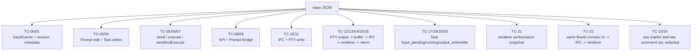

另一个 Agent 新增的三方审计和叙述工具补上了“验证是否穷举”和“人能不能读懂”的证明：

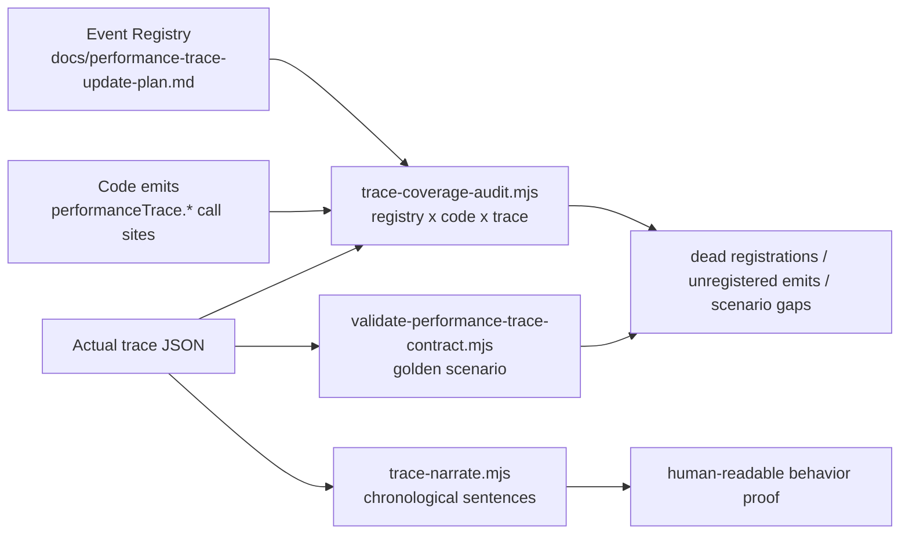

| 合同 | 证明点 |
| --- | --- |
| TC-03/04 | 用户输入和选择目标 Task 可以被看到 |
| TC-05/06/07 | 三类 Prompt 操作都有耗时和结果 |
| TC-08/09 | 外部 API 到 renderer Prompt Bridge 的链路可见 |
| TC-10/11 | 主线程 IPC 和 PTY 写入可见 |
| TC-12 到 TC-16 | 子进程输出回到 renderer 并被写进界面的链路可见 |
| TC-17 到 TC-20 | Task 是否工作、何时输出、何时 idle 可见 |
| TC-22 | 同一用户动作的跨进程 flow 可串起来 |
| TC-23/24 | 默认配置不会泄漏原始输入内容 |
| Coverage audit | registry、代码 emit、实际 trace 三者一致，没有未登记事件或死登记 |
| Trace narration | 可以按时间顺序读出 Onward 当时在做什么 |

## 常见行为到 Trace Point 的速查

| 你要验证的行为 | 需要看到的 trace point |
| --- | --- |
| 用户输入了什么规模的内容 | `ui.prompt.edit.payloadLength`, `payloadLineCount`, `payloadHash` |
| 用户选择了哪个 Task | `ui.prompt.task_select.terminalId`, `selectedCount` |
| Send 是否发生以及花多久 | `ui.prompt.action[action=send].dur` |
| Execute 是否真的触发命令 | `ipc.terminal.write.includesEnter=true`, `terminal.task.state[state=running]` |
| 命令是否真正写入 PTY | `pty.write.result=success` 或 `pty.send_input_sequence.result=success` |
| Task 是否在后台工作 | `terminal.task.state` 从 `input_pending/running` 到 `output_active` |
| Task 输出是否回到主进程 | `pty.output.bytes` |
| 主进程是否把输出发给 renderer | `terminal.buffer.flush`, `terminal.ipc.send` |
| 用户界面是否真正渲染输出 | `terminal.render.receive`, `terminal.render.flush` |
| 渲染是否慢 | `terminal.render.flush.dur`, `xtermDurationMs`, `perf.renderer.snapshot` |
| API 写入是否走通 | `api.request.status`, `prompt.bridge.result`, `ui.prompt.action` |
| Coding Agent 是否以 PTY 方式启动 | `coding_agent.launch`, `pty.spawn`, `terminal.task.state[state=running]` |
| Git polling / cwd probe 是否堆积 | `git.runtime.task.queueDepth`, `inflight`, `dur` |
| Markdown preview 是否慢 | `markdown.render.worker.dur`, `project_editor.render.apply.dur` |
| PTY 是否清理干净 | `pty.dispose`, `pty.shutdown_all.closed`, `timedOut` |
| trace registry 是否和代码一致 | `node scripts/trace-coverage-audit.mjs --latest` |
| trace 是否能被人读懂 | `node scripts/trace-narrate.mjs --latest` |

## 最小验证命令

macOS development build 的常用验证命令：

```bash
rm -rf out release && ONWARD_DIST_DEV_OPEN=0 pnpm dist:dev
bash test/run-performance-trace-autotest.sh "release/mac/Under Development 2.0.1-event_trace_gate_0424_codex.app/Contents/MacOS/Under Development 2.0.1-event_trace_gate_0424_codex"
```

脚本会输出 trace 文件路径，并调用：

```bash
node test/validate-performance-trace-contract.mjs "<trace-file>"
node scripts/trace-coverage-audit.mjs "<trace-file>"
node scripts/trace-narrate.mjs "<trace-file>" | head -80
```

通过标准是：

```text
Performance trace contract PASSED: 25 checks
```
