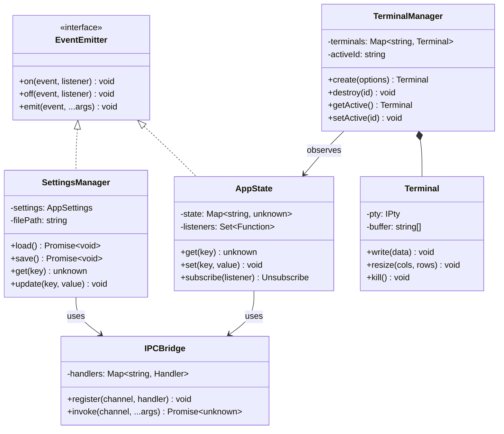
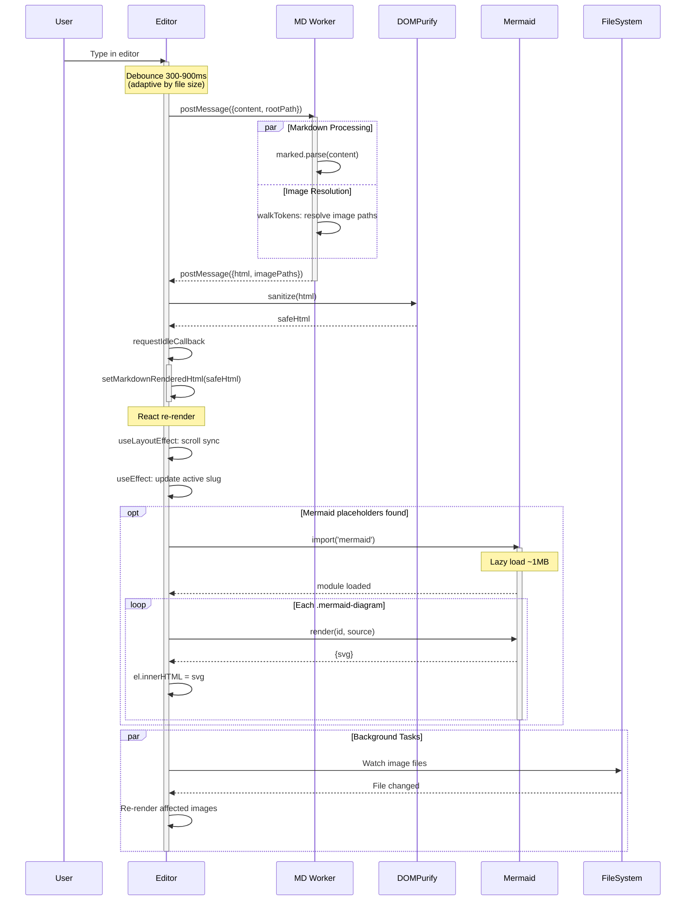
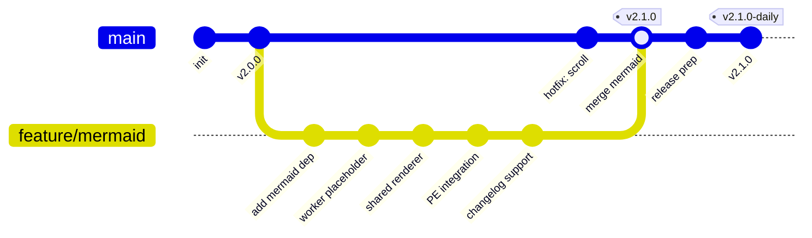
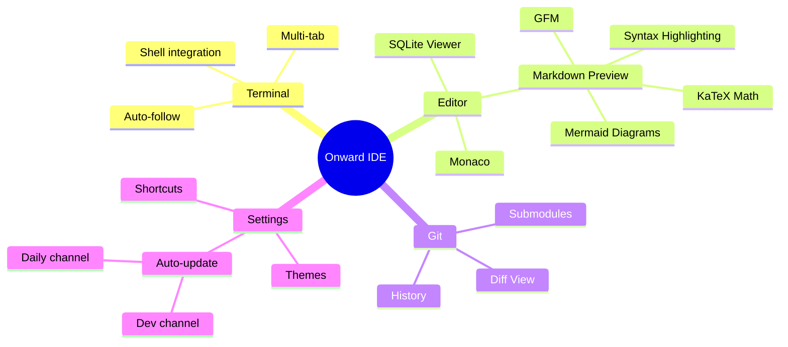
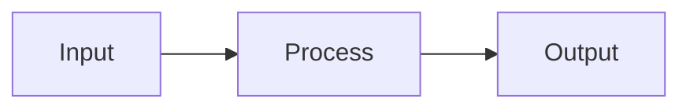
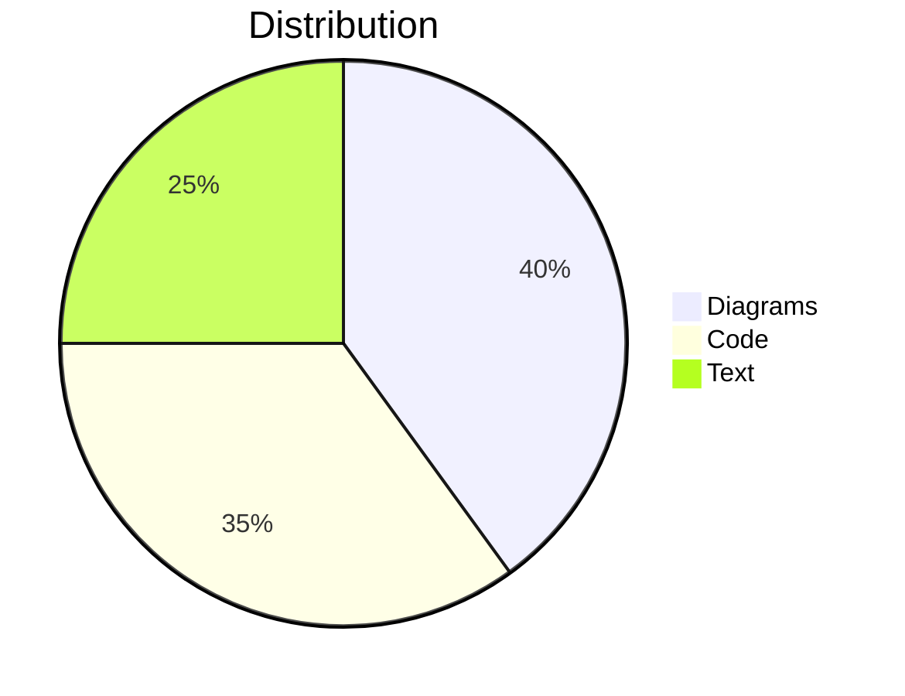
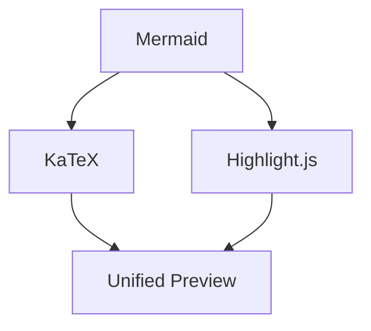

# Mermaid Complex - Advanced Diagrams

## 1. Class Diagram - Design Patterns



## 2. Sequence - Complex Async Flow



## 3. Gitgraph



## 4. Mindmap



## 5. Error Case (Syntax Error Test)

This block has intentional syntax errors to test error handling:

```mermaid
graph TD
    A --> B
    B --> C
    C -->
    INVALID SYNTAX HERE !!!
```

## 6. Mixed Content Stress Test

Regular text before a diagram.



Some **bold** and *italic* text between diagrams, with `inline code` and a [link](https://example.com).

> A blockquote between mermaid blocks to verify DOM structure is preserved.



$$
E = mc^2
$$

A LaTeX formula above, followed by another diagram:



| Feature | Status |
|---------|--------|
| GFM Tables | Done |
| KaTeX | Done |
| Mermaid | Done |

End of mixed content test.
