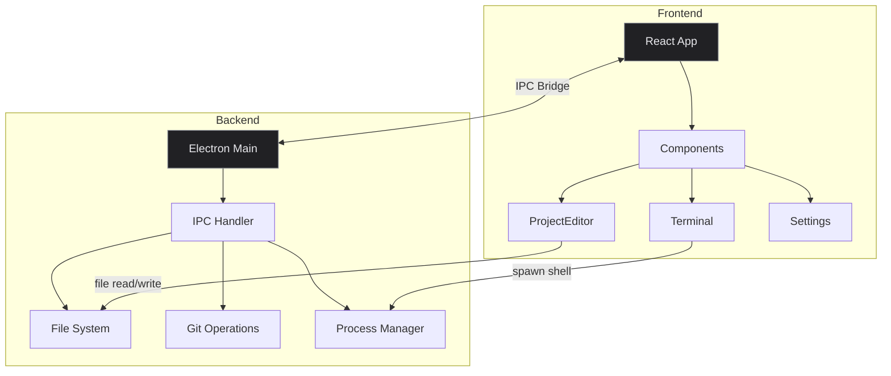
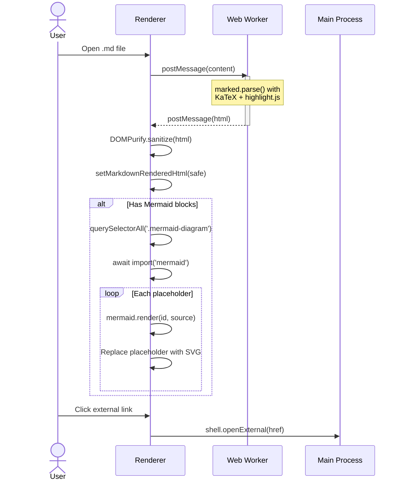
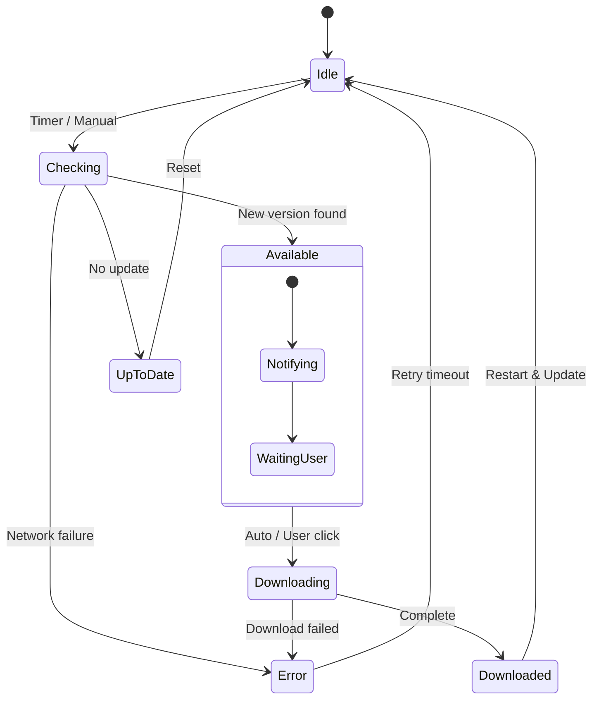
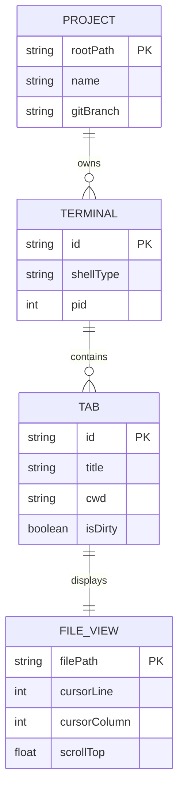
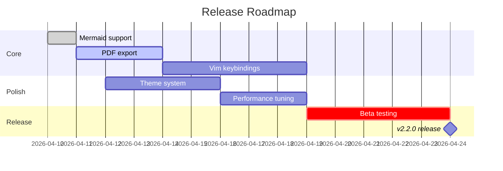

# Mermaid Medium - Intermediate Diagrams

## 1. Flowchart with Subgraphs

```mermaid
graph TB
    subgraph Frontend
        A[React App] --> B[Components]
        B --> C[ProjectEditor]
        B --> D[Terminal]
        B --> E[Settings]
    end
    subgraph Backend
        F[Electron Main] --> G[IPC Handler]
        G --> H[File System]
        G --> I[Git Operations]
        G --> J[Process Manager]
    end
    A <-->|IPC Bridge| F
    C -->|file read/write| H
    D -->|spawn shell| J
    style A fill:#212124,stroke:#8b8f98,color:#e8e8ec
    style F fill:#212124,stroke:#8b8f98,color:#e8e8ec
```

## 2. Sequence Diagram with Actors and Notes

```mermaid
sequenceDiagram
    actor User
    participant R as Renderer
    participant W as Web Worker
    participant M as Main Process

    User->>R: Open .md file
    R->>W: postMessage(content)
    activate W
    Note over W: marked.parse() with<br/>KaTeX + highlight.js
    W-->>R: postMessage(html)
    deactivate W
    R->>R: DOMPurify.sanitize(html)
    R->>R: setMarkdownRenderedHtml(safe)

    alt Has Mermaid blocks
        R->>R: querySelectorAll('.mermaid-diagram')
        R->>R: await import('mermaid')
        loop Each placeholder
            R->>R: mermaid.render(id, source)
            R->>R: Replace placeholder with SVG
        end
    end

    User->>R: Click external link
    R->>M: shell.openExternal(href)
```

## 3. State Diagram

```mermaid
stateDiagram-v2
    [*] --> Idle
    Idle --> Checking : Timer / Manual
    Checking --> Available : New version found
    Checking --> UpToDate : No update
    Checking --> Error : Network failure
    Available --> Downloading : Auto / User click
    Downloading --> Downloaded : Complete
    Downloading --> Error : Download failed
    Downloaded --> Idle : Restart & Update
    UpToDate --> Idle : Reset
    Error --> Idle : Retry timeout

    state Available {
        [*] --> Notifying
        Notifying --> WaitingUser
    }
```

## 4. ER Diagram

```mermaid
erDiagram
    TERMINAL ||--o{ TAB : contains
    TAB ||--|| FILE_VIEW : displays
    TAB {
        string id PK
        string title
        string cwd
        boolean isDirty
    }
    FILE_VIEW {
        string filePath PK
        int cursorLine
        int cursorColumn
        float scrollTop
    }
    TERMINAL {
        string id PK
        string shellType
        int pid
    }
    PROJECT ||--o{ TERMINAL : owns
    PROJECT {
        string rootPath PK
        string name
        string gitBranch
    }
```

## 5. Gantt Chart

```mermaid
gantt
    title Release Roadmap
    dateFormat YYYY-MM-DD
    section Core
        Mermaid support        :done, m1, 2026-04-10, 1d
        PDF export             :active, m2, 2026-04-11, 3d
        Vim keybindings        :m3, after m2, 5d
    section Polish
        Theme system           :t1, 2026-04-12, 4d
        Performance tuning     :t2, after t1, 3d
    section Release
        Beta testing           :crit, r1, after m3, 5d
        v2.2.0 release         :milestone, r2, after r1, 0d
```
