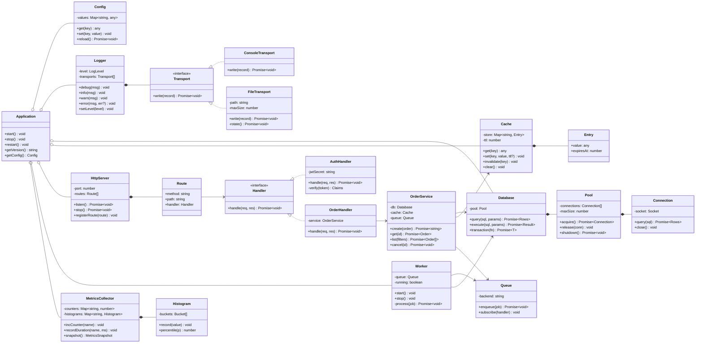

# Huge Mermaid Diagram

A dense, large diagram that exceeds the viewport in both dimensions. Stress-tests zoom-out to fit and zoom-in to inspect detail.

```mermaid
classDiagram
    direction LR
    class Application {
        +start() void
        +stop() void
        +restart() void
        +getVersion() string
        +getConfig() Config
    }
    class Config {
        -values: Map~string, any~
        +get(key) any
        +set(key, value) void
        +reload() Promise~void~
    }
    class Logger {
        -level: LogLevel
        -transports: Transport[]
        +debug(msg) void
        +info(msg) void
        +warn(msg) void
        +error(msg, err?) void
        +setLevel(level) void
    }
    class Transport {
        <<interface>>
        +write(record) Promise~void~
    }
    class ConsoleTransport {
        +write(record) Promise~void~
    }
    class FileTransport {
        -path: string
        -maxSize: number
        +write(record) Promise~void~
        -rotate() Promise~void~
    }
    class Database {
        -pool: Pool
        +query(sql, params) Promise~Rows~
        +execute(sql, params) Promise~Result~
        +transaction(fn) Promise~T~
    }
    class Pool {
        -connections: Connection[]
        -maxSize: number
        +acquire() Promise~Connection~
        +release(conn) void
        +shutdown() Promise~void~
    }
    class Connection {
        -socket: Socket
        +query(sql) Promise~Rows~
        +close() void
    }
    class Cache {
        -store: Map~string, Entry~
        -ttl: number
        +get(key) any
        +set(key, value, ttl?) void
        +invalidate(key) void
        +clear() void
    }
    class Entry {
        +value: any
        +expiresAt: number
    }
    class HttpServer {
        -port: number
        -routes: Route[]
        +listen() Promise~void~
        +stop() Promise~void~
        +registerRoute(route) void
    }
    class Route {
        +method: string
        +path: string
        +handler: Handler
    }
    class Handler {
        <<interface>>
        +handle(req, res) Promise~void~
    }
    class AuthHandler {
        -jwtSecret: string
        +handle(req, res) Promise~void~
        -verify(token) Claims
    }
    class OrderHandler {
        -service: OrderService
        +handle(req, res) Promise~void~
    }
    class OrderService {
        -db: Database
        -cache: Cache
        -queue: Queue
        +create(order) Promise~string~
        +get(id) Promise~Order~
        +list(filters) Promise~Order[]~
        +cancel(id) Promise~void~
    }
    class Queue {
        -backend: string
        +enqueue(job) Promise~void~
        +subscribe(handler) void
    }
    class Worker {
        -queue: Queue
        -running: boolean
        +start() void
        +stop() void
        -process(job) Promise~void~
    }
    class MetricsCollector {
        -counters: Map~string, number~
        -histograms: Map~string, Histogram~
        +incCounter(name) void
        +recordDuration(name, ms) void
        +snapshot() MetricsSnapshot
    }
    class Histogram {
        -buckets: Bucket[]
        +record(value) void
        +percentile(p) number
    }
    Application o-- Config
    Application o-- Logger
    Application o-- Database
    Application o-- Cache
    Application o-- HttpServer
    Application o-- Worker
    Application o-- MetricsCollector
    Logger *-- Transport
    Transport <|.. ConsoleTransport
    Transport <|.. FileTransport
    Database *-- Pool
    Pool *-- Connection
    Cache *-- Entry
    HttpServer *-- Route
    Route --> Handler
    Handler <|.. AuthHandler
    Handler <|.. OrderHandler
    OrderHandler --> OrderService
    OrderService --> Database
    OrderService --> Cache
    OrderService --> Queue
    Worker --> Queue
    Worker --> Database
    MetricsCollector *-- Histogram
```
