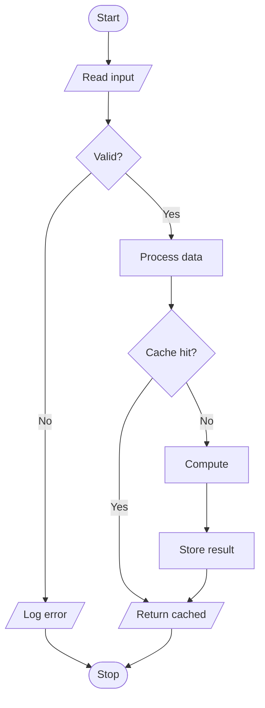
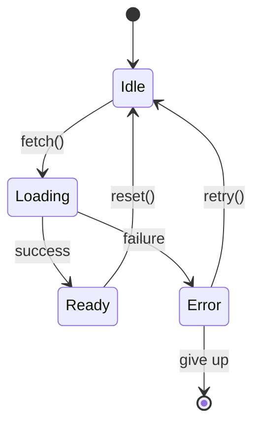
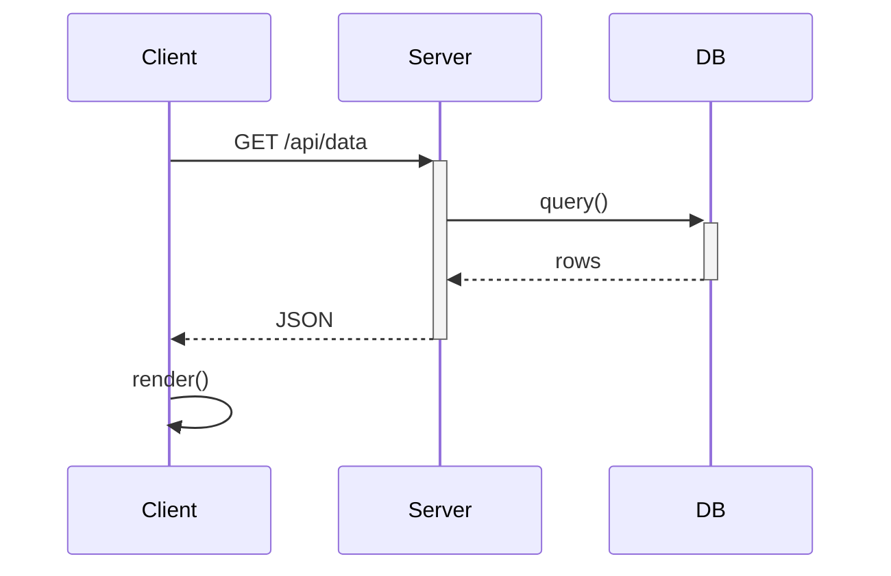

# Medium Mermaid Diagrams

Medium complexity diagrams that should fit comfortably in the default viewport.

## Flowchart with conditionals

```mermaid
graph TD
    Start([Start]) --> Input[/Read input/]
    Input --> Validate{Valid?}
    Validate -- No --> Error[/Log error/] --> Stop([Stop])
    Validate -- Yes --> Process[Process data]
    Process --> Cache{Cache hit?}
    Cache -- Yes --> Return[/Return cached/]
    Cache -- No --> Compute[Compute]
    Compute --> Store[Store result]
    Store --> Return
    Return --> Stop
```

## State machine

```mermaid
stateDiagram-v2
    [*] --> Idle
    Idle --> Loading: fetch()
    Loading --> Ready: success
    Loading --> Error: failure
    Ready --> Idle: reset()
    Error --> Idle: retry()
    Error --> [*]: give up
```

## Simple sequence

```mermaid
sequenceDiagram
    Client->>+Server: GET /api/data
    Server->>+DB: query()
    DB-->>-Server: rows
    Server-->>-Client: JSON
    Client->>Client: render()
```
