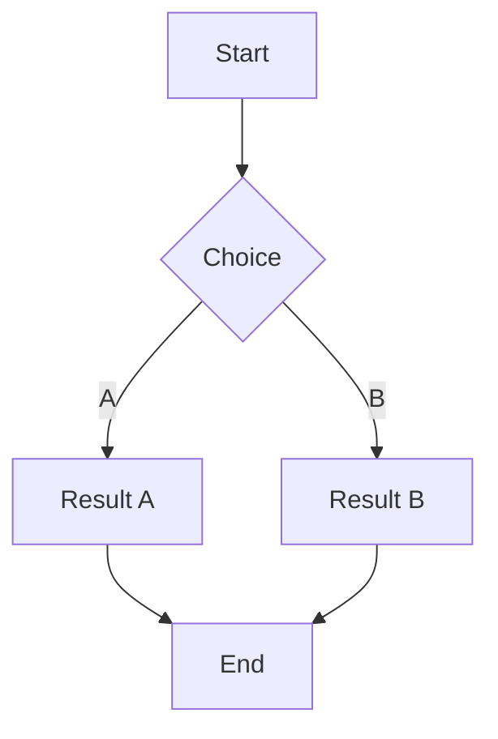
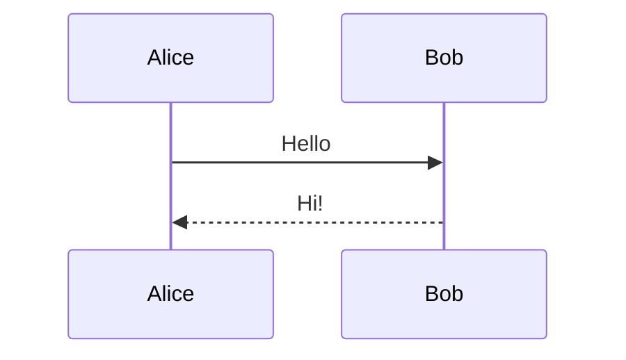
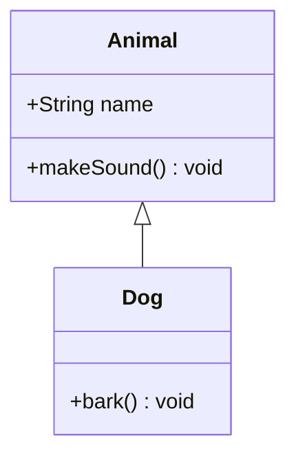
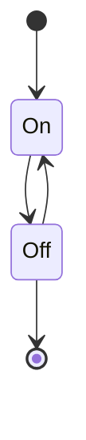
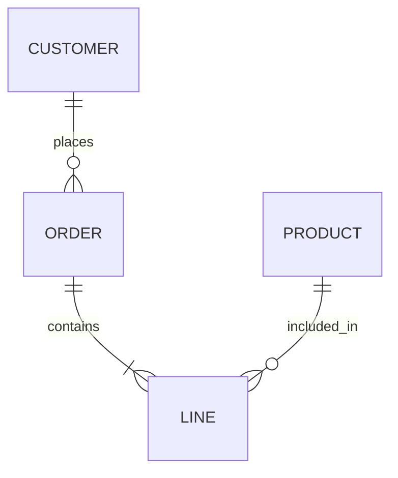
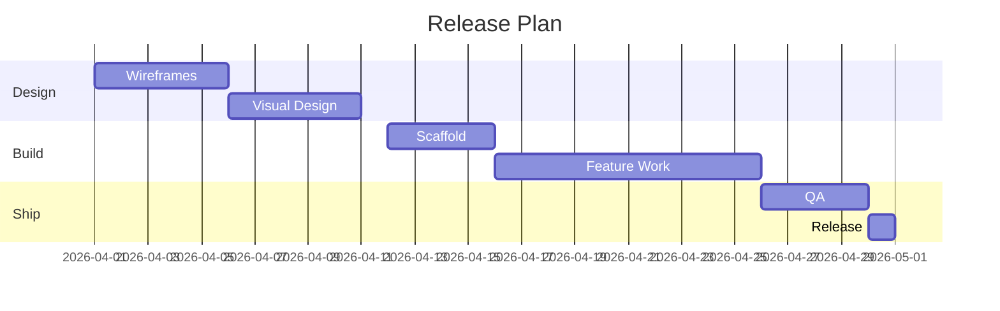
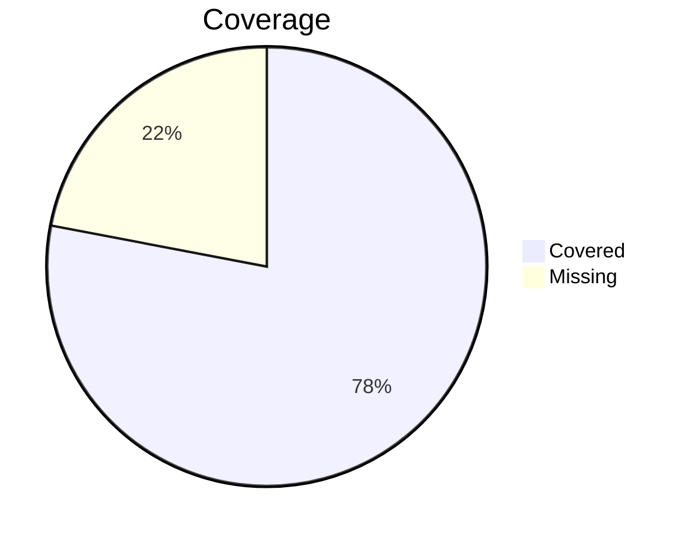
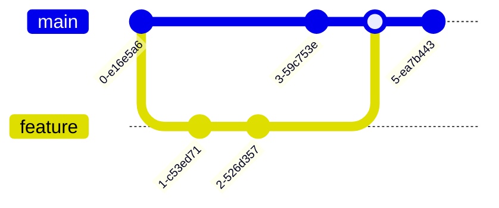
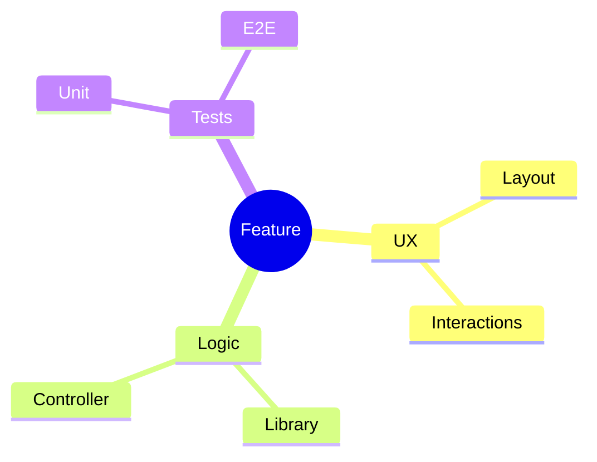
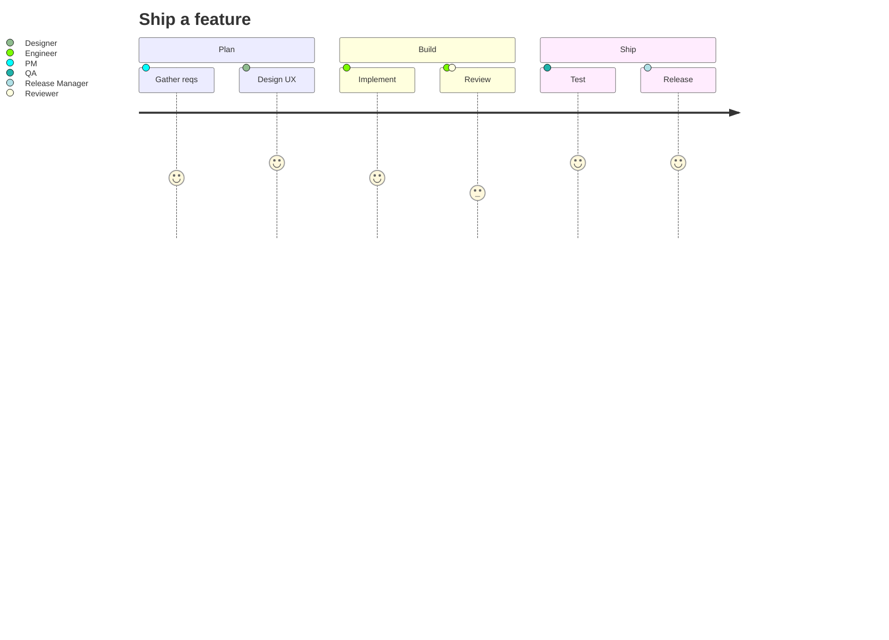

# Mixed Mermaid Types

One of each major diagram type. Verifies the pan/zoom enhancer works regardless of underlying SVG structure.

## 1. Flowchart

## 2. Sequence

## 3. Class

## 4. State

## 5. Entity Relationship

## 6. Gantt

## 7. Pie

## 8. Git Graph

## 9. Mindmap

## 10. Journey

