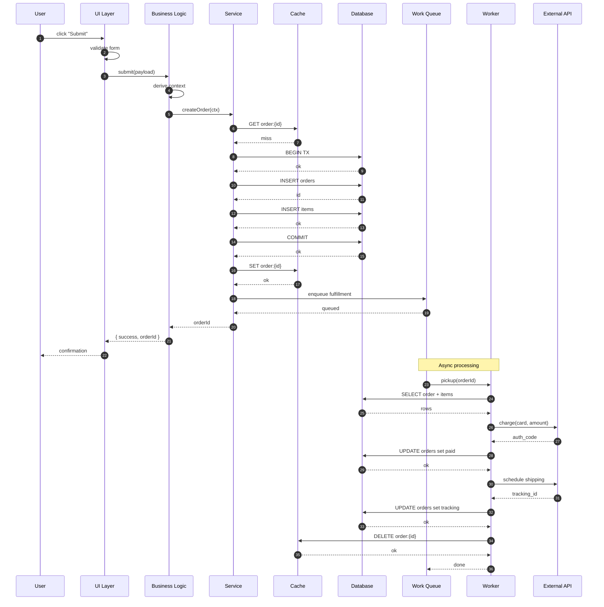

# Tall Mermaid Diagram

A vertically-tall sequence diagram that exceeds the viewport's vertical budget and needs pan to inspect the bottom.

```mermaid
sequenceDiagram
    autonumber
    participant U as User
    participant UI as UI Layer
    participant BL as Business Logic
    participant SVC as Service
    participant CACHE as Cache
    participant DB as Database
    participant WQ as Work Queue
    participant W as Worker
    participant EXT as External API

    U->>UI: click "Submit"
    UI->>UI: validate form
    UI->>BL: submit(payload)
    BL->>BL: derive context
    BL->>SVC: createOrder(ctx)
    SVC->>CACHE: GET order:{id}
    CACHE-->>SVC: miss
    SVC->>DB: BEGIN TX
    DB-->>SVC: ok
    SVC->>DB: INSERT orders
    DB-->>SVC: id
    SVC->>DB: INSERT items
    DB-->>SVC: ok
    SVC->>DB: COMMIT
    DB-->>SVC: ok
    SVC->>CACHE: SET order:{id}
    CACHE-->>SVC: ok
    SVC->>WQ: enqueue fulfillment
    WQ-->>SVC: queued
    SVC-->>BL: orderId
    BL-->>UI: { success, orderId }
    UI-->>U: confirmation

    Note over WQ,W: Async processing
    WQ->>W: pickup(orderId)
    W->>DB: SELECT order + items
    DB-->>W: rows
    W->>EXT: charge(card, amount)
    EXT-->>W: auth_code
    W->>DB: UPDATE orders set paid
    DB-->>W: ok
    W->>EXT: schedule shipping
    EXT-->>W: tracking_id
    W->>DB: UPDATE orders set tracking
    DB-->>W: ok
    W->>CACHE: DELETE order:{id}
    CACHE-->>W: ok
    W-->>WQ: done
```
