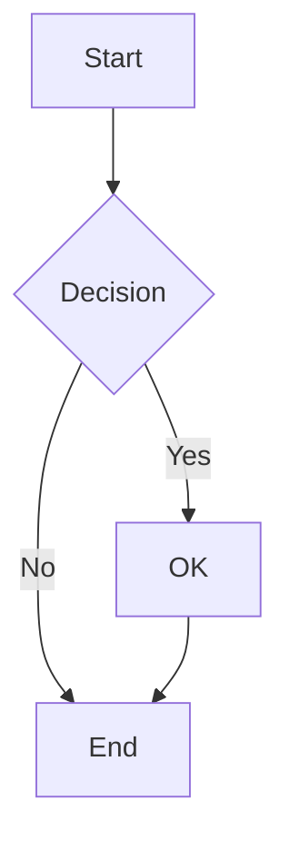
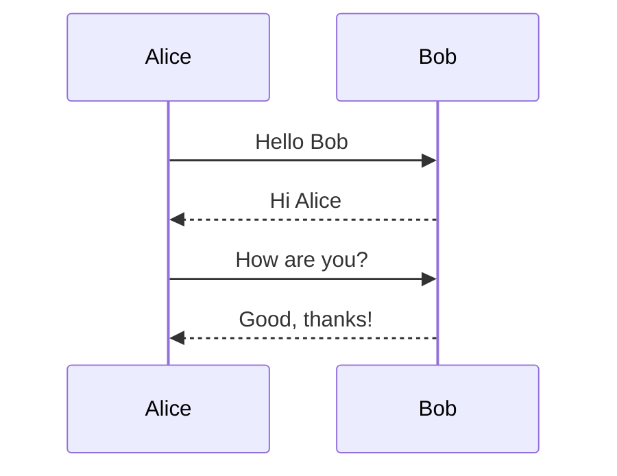
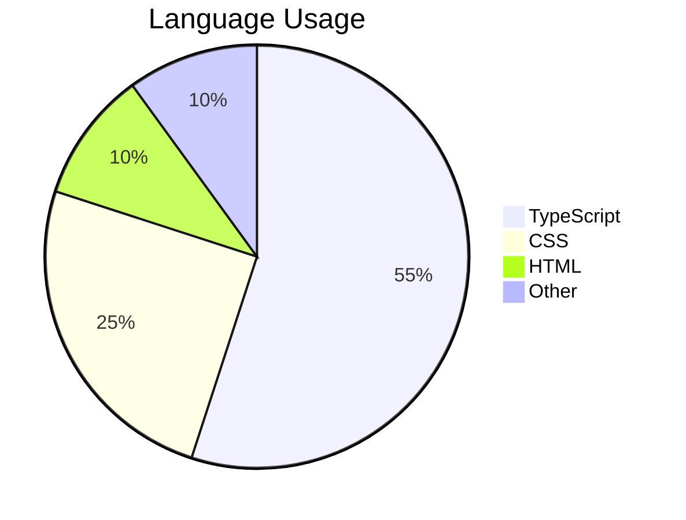

# Mermaid Simple - Basic Diagrams

## 1. Flowchart



## 2. Sequence Diagram



## 3. Pie Chart



## 4. Non-Mermaid Code Block (Regression Test)

This should render as normal syntax-highlighted code, not as a diagram:

```typescript
function greet(name: string): string {
  return `Hello, ${name}!`
}
```

```json
{
  "name": "onward",
  "version": "2.0.1"
}
```
