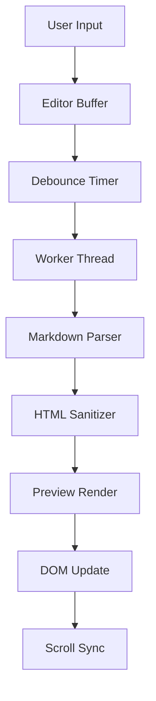
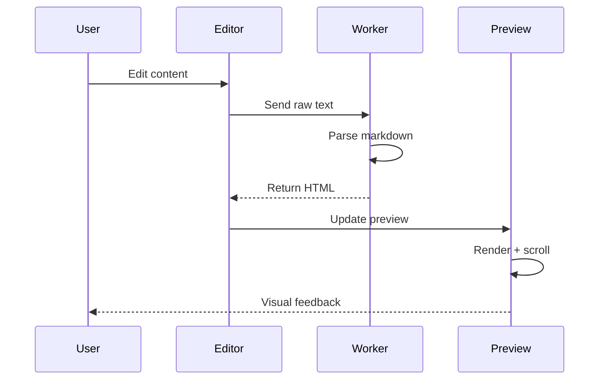
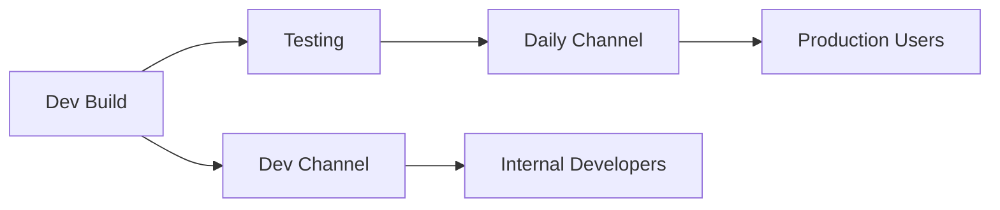

# Complex System Architecture Document

This document describes the overall system design and serves as a test fixture
for the preview search automated test suite. The word "system" appears
throughout various markdown structures to validate search ordering and navigation.

## System Overview

The system is composed of multiple interconnected modules that work together
to provide a seamless user experience. Each subsystem handles a specific
domain and communicates through well-defined interfaces.

At its core, the system follows an event-driven architecture where state
changes propagate through a central message bus. This design ensures loose
coupling between the various system components.

### Core System Components

The following table describes the main system modules:

| Module | Responsibility | System Layer |
|--------|---------------|--------------|
| Terminal Manager | Process lifecycle, PTY management | system core |
| Editor Engine | File editing, syntax highlighting | system core |
| Preview Renderer | Markdown to HTML conversion | system middleware |
| Git Integration | Version control operations | system service |
| Settings Store | User preference persistence | system storage |
| IPC Bridge | Cross-process communication | system transport |

Additional system metrics and performance counters:

| Metric | Target | System Threshold |
|--------|--------|-----------------|
| Startup time | < 2s | system critical |
| Memory usage | < 512MB | system warning at 80% |
| Render latency | < 16ms | system frame budget |
| IPC round-trip | < 5ms | system acceptable |

### Detailed System Module Descriptions

1. **Terminal Manager**: This system module creates and manages terminal
   instances across the application lifecycle.
   - Each terminal runs in an isolated system process
   - The system monitors resource usage per terminal
   - Cleanup is handled by the system garbage collector

2. **Editor Engine**: The core editing system provides:
   - Syntax highlighting via a system of grammar definitions
   - Auto-completion powered by the system language server
   - File watching through the system file observer

3. **Preview Renderer**: A system for converting markdown to HTML:
   - Supports GFM extensions in the system pipeline
   - Math rendering via the system KaTeX integration
   - Diagram rendering through the system Mermaid bridge

> The system architecture was designed with extensibility in mind.
> Each system module can be replaced or upgraded independently,
> as long as the system interface contracts are maintained.
> This makes the overall system resilient to individual component failures.

---

## System Data Flow

The following diagram illustrates how data flows through the system:



After the rendering pipeline completes, the system updates the preview
panel and synchronizes the scroll position. The system ensures that
the visible portion of the preview corresponds to the cursor location
in the editor.

### System Interaction Sequence



The system uses a dedicated worker thread to avoid blocking the main
UI thread during parsing. This is a critical system design decision
that prevents input lag even with large documents.

---

## System Configuration

The system settings are organized in a hierarchical structure:

- **Global system settings**
  - Theme (the system supports light and dark modes)
  - Language (the system currently supports English and Chinese)
  - Font configuration
    - Editor font (system monospace default)
    - UI font (system sans-serif default)
    - Terminal font (system monospace default)
- **Workspace system settings**
  - Git configuration
    - The system auto-detects repository roots
    - Submodule handling (the system supports recursive detection)
  - Build configuration
    - The system reads build scripts from package.json
    - Custom build commands per system workspace

### System Environment Variables

The system reads several environment variables at startup:

```typescript
// System debug flags
const ONWARD_DEBUG = process.env.ONWARD_DEBUG === '1'
const ONWARD_AUTOTEST = process.env.ONWARD_AUTOTEST === '1'

// System configuration paths
const CONFIG_DIR = path.join(os.homedir(), '.onward')
const SYSTEM_LOG_PATH = path.join(CONFIG_DIR, 'logs')

interface SystemConfig {
  debugEnabled: boolean
  autotestMode: boolean
  logPath: string
  maxTerminals: number
  renderTimeout: number
}

function loadSystemConfig(): SystemConfig {
  // Read from system config file
  return {
    debugEnabled: ONWARD_DEBUG,
    autotestMode: ONWARD_AUTOTEST,
    logPath: SYSTEM_LOG_PATH,
    maxTerminals: 12,
    renderTimeout: 5000,
  }
}
```

The system configuration module handles defaults, validation, and
migration between versions. When the system detects an outdated
configuration format, it automatically migrates to the latest schema.

---

## System Performance Characteristics

The system has been optimized for the following performance targets.
Each system subsystem is profiled independently to identify bottlenecks.

### Rendering Pipeline Performance

The markdown rendering system operates in several phases:

1. **Tokenization**: The system lexer breaks the raw text into tokens.
   This phase typically takes 1-3ms for documents under 10,000 lines.

2. **Parsing**: The system parser converts tokens into an AST.
   Complex documents with nested structures may take longer.

3. **HTML Generation**: The system serializer walks the AST and
   produces HTML output. This phase includes image path resolution.

4. **Sanitization**: The system sanitizer (DOMPurify) strips any
   unsafe content while preserving the rendering fidelity.

5. **DOM Diffing**: The system uses innerHTML for efficiency rather
   than a virtual DOM approach. This is a deliberate system trade-off.

### System Memory Management

The system implements several strategies to control memory usage:

- **Terminal buffer limits**: Each system terminal has a configurable
  scrollback buffer. The system default is 10,000 lines.

- **Preview cache**: The system caches rendered HTML to avoid
  re-rendering unchanged content. Cache invalidation follows
  a system of content hashing.

- **Editor model disposal**: When files are closed, the system
  disposes of Monaco editor models to reclaim memory.

> The system garbage collection strategy ensures that transient
> objects are cleaned up within one render cycle. The system
> also monitors for memory leaks during development builds.

---

## System Error Handling

The system follows a layered error handling strategy:

### Error Classification

| Error Type | System Response | Recovery |
|-----------|----------------|----------|
| Network timeout | system retry with backoff | Automatic |
| File not found | system shows notification | User action |
| Parse error | system falls back to raw text | Automatic |
| OOM error | system triggers cleanup | Semi-automatic |

### System Logging

The system logging infrastructure captures errors at multiple levels:

- **system trace**: Low-level system operations (file I/O, IPC)
- **system debug**: Diagnostic information for system developers
- **system info**: Normal system operation milestones
- **system warn**: Recoverable system anomalies
- **system error**: Unrecoverable system failures

```typescript
class SystemLogger {
  private level: 'trace' | 'debug' | 'info' | 'warn' | 'error'

  log(level: string, message: string, context?: Record<string, unknown>): void {
    // Write to system log file and optionally to console
    const entry = {
      timestamp: Date.now(),
      level,
      message,
      ...context,
    }
    // System log rotation happens at 10MB
    this.writeToSystemLog(entry)
  }

  private writeToSystemLog(entry: unknown): void {
    // Implementation of system log writer
  }
}
```

---

## System Testing Strategy

The system uses multiple testing approaches:

### Unit Tests
Individual system functions are tested in isolation.

### Integration Tests
System modules are tested together to verify correct interaction.
The system provides mock implementations for external dependencies.

### End-to-End Tests
The complete system is exercised through the autotest framework,
which runs inside the actual Electron system process.

### Performance Regression Tests
The system performance is measured against baselines defined in
the performance regression guide. Each system release must meet
or exceed these benchmarks.

---

## System Deployment



The system deployment follows a two-channel strategy:

- **Daily channel**: The system automatically checks for updates
  every hour and downloads new versions in the background.

- **Dev channel**: The system requires manual update checks,
  giving developers full control over their system version.

### System Version Management

The system uses semantic versioning with channel-specific suffixes.
Each system build is tagged in the format `v2.1.0-channel.YYYYMMDD.N`.

| Channel | Tag Format | System Behavior |
|---------|-----------|-----------------|
| Daily | `v2.1.0-daily.YYYYMMDD.N` | system auto-update |
| Dev | `v2.1.0-dev.YYYYMMDD.N` | system manual check |

---

## System Internationalization

The system supports multiple languages through an i18n module:

- The system currently supports English (en) and Chinese (zh-CN)
- Each system UI string is referenced by a translation key
- The system falls back to English when a translation is missing
- System menus, dialogs, and tooltips all go through the i18n system

### Translation Workflow

1. Developer adds a system string key to the English dictionary
2. The system string is translated to all supported languages
3. The system CI verifies that all keys exist in every locale
4. The system loads the appropriate locale at startup

---

## System Security Considerations

The system follows security best practices:

- All system IPC channels use structured data, not raw strings
- The system renderer process runs with context isolation enabled
- The system uses a strict Content Security Policy
- Third-party system dependencies are audited for license compliance
- The system never stores credentials in plain text

> A secure system is not just about preventing attacks; it is about
> building a system that fails safely when unexpected inputs arrive.
> The system must validate all data at trust boundaries.

---

## System Future Roadmap

Planned system enhancements for upcoming releases:

1. **Plugin system**: Allow third-party extensions to the system
2. **Remote system support**: SSH-based terminal connections
3. **Collaborative system features**: Real-time pair programming
4. **System telemetry dashboard**: Usage analytics and crash reports
5. **Custom system themes**: User-defined color schemes and layouts

Each system feature will go through the standard RFC process before
implementation begins. The system architecture review board must
approve any changes that affect the core system interfaces.

---

## Appendix: System Glossary

| Term | Definition |
|------|-----------|
| System core | The fundamental system infrastructure modules |
| System service | A background system process that handles specific tasks |
| System middleware | A system layer that transforms data between modules |
| System transport | The system communication layer (IPC, HTTP, WebSocket) |
| System storage | Persistent system data stores (SQLite, JSON files) |

---

*This document is maintained as part of the system architecture reference.
Last updated as part of the system documentation review cycle.*
